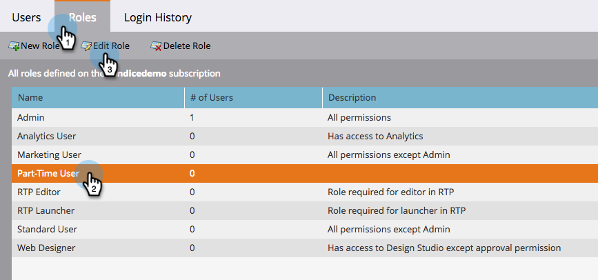
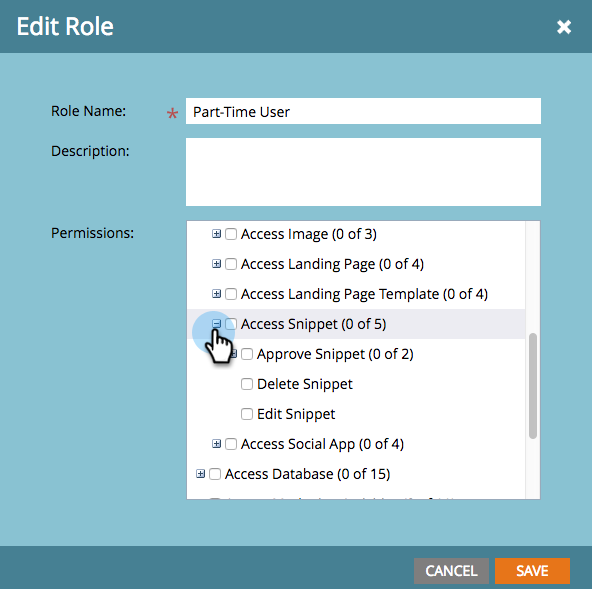

# 코드 단편에 초안 없음 사용 {#enable-no-draft-for-snippets}

코드 조각에 대한 초안 작성 기능을 사용하면 코드 조각 변경 내용을 사용하여 승인된 자산을 초안을 작성하지 않고도 배포할 수 있습니다. 편집된 조각을 사용하는 모든 자산은 업데이트를 얻고 각각의 상태를 유지합니다.

* 승인된 자산은 코드 조각 업데이트를 받고 승인 상태를 유지합니다.

* 초안으로 코드 조각 업데이트를 가져와 초안 모드에서 유지

초안 없음은 모든 관리자 역할에 대해 자동으로 활성화됩니다. 그러면 관리자는 추가 역할에 대해 이 기능을 활성화할 수 있습니다.

>[!NOTE]
>
>**관리자 권한 필요**

1. 관리자로 **이동하고** 사용자 및 **역할을 클릭합니다**.

   

1. 역할 **탭으로** 가서 역할을 선택한 다음 역할 **편집을 클릭합니다**.

   

1. 액세스 **디자인 스튜디오** 옵션을 확장합니다.

   

1. 액세스 조각 **옵션을** 확장합니다.

   

1. 코드 **조각** 승인 권한을 확장하고 [초안 **없음]** 상자를선택합니다. 그런 다음 **저장을 클릭합니다**.

   

>[!TIP]
>
>[초안 없음]을 비활성화하려면 위의 1-4단계를 따르고 [초안 없음] 확인란의 선택을 취소한 다음 [ **저장]을 클릭합니다**.

>[!MORELIKETHIS]
>
>[초안 없는 코드 조각 승인](../../../../product-docs/personalization/segmentation-and-snippets/snippets/approve-a-snippet-with-no-draft.md)

