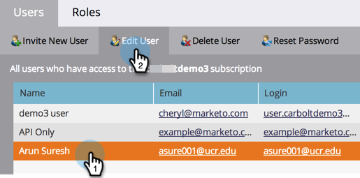

# Workspace에 대한 사용자 액세스 허용 {#allow-user-access-to-a-workspace}

작업 영역은 어떤 이유로든 가능합니다(예: 사업부 또는 지역 분리). 각 팀의 에셋(스마트 목록, 프로그램 등)을 구분합니다. 사용자에게 하나 이상의 작업 영역에 대한 액세스 권한을 부여하는 방법은 다음과 같습니다.

>[!NOTE]
>
>**관리자 권한 필요**

>[!NOTE]
>
>[작업 공간](/help/marketo/product-docs/administration/workspaces-and-person-partitions/understanding-workspaces-and-person-partitions.md)에 대해 자세히 알아보세요.

1. **[!UICONTROL Admin]** 영역으로 이동합니다.

   

1. **[!UICONTROL Users & Roles]**&#x200B;을(를) 클릭합니다.

   

1. **[!UICONTROL Users]** 탭에서 사용자를 선택하고 **[!UICONTROL Edit User]**&#x200B;을(를) 클릭합니다.

   

1. 사용자가 액세스할 **[!UICONTROL Roles and Workspaces]**&#x200B;을(를) 선택하십시오.

   

   >[!NOTE]
   >
   >사용자가 작업 공간에 대한 모든 액세스 권한을 조합해서 보유하도록 허용할 수 있습니다.

변경 사항을 저장한 후 업데이트가 표시됩니다.

