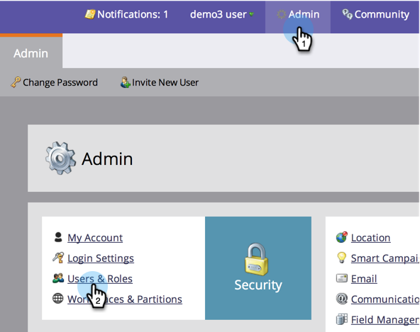

# 작업 공간 {#allow-user-access-to-a-workspace}에 대한 사용자 액세스 허용

작업 영역은 비즈니스 단위 또는 지역 분리와 같은 어떤 이유에서든 사용할 수 있습니다. 자산(스마트 목록, 프로그램 등)은 분리됩니다. 각 팀 간의 작업 수행. 사용자가 하나 이상의 작업 영역에 액세스할 수 있도록 하는 방법은 다음과 같습니다.

>[!NOTE]
>
>**관리자 권한 필요**

>[!NOTE]
>
>**자세히 알아보기**
>
>[작업 영역](understanding-workspaces-and-person-partitions.md)에 대해 자세히 알아보십시오.

1. 관리에서 사용자 및 역할을 클릭합니다.

1. **Users **탭에서 사용자를 선택하고 **사용자 편집**&#x200B;을 클릭합니다.

   

1. 사용자에게 액세스 권한을 부여할 **역할 및 작업 공간**&#x200B;을 선택합니다.

   >[!NOTE]
   >
   >사용자가 작업 영역에 대한 모든 액세스를 조합하도록 허용할 수 있습니다.

   

1. 변경 내용을 저장한 후에는 업데이트가 표시됩니다!

   

   좋아요! 이제 사용자가 로그인하면 액세스할 수 있는 모든 작업 영역이 표시됩니다.

