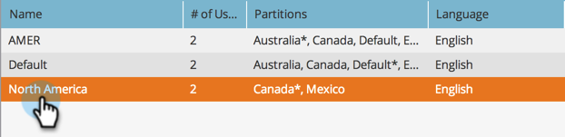

# 작업 공간에 개인 분할 영역 지정 {#assign-person-partitions-to-workspaces}

개인 파티션/작업 공간 할당을 편집하는 방법은 다음과 같습니다.

>[!NOTE]
>
>**관리자 권한 필요**

>[!PREREQUISITES]
>
>[새 Workspace 만들기](/help/marketo/product-docs/administration/workspaces-and-person-partitions/create-a-new-workspace.md){target="_blank"}

>[!CAUTION]
>
>작업 영역과 개인 파티션은 복잡할 수 있습니다. 설정하는 데 도움이 필요하면 [Marketo 지원](https://nation.marketo.com/t5/Support/ct-p/Support){target="_blank"}에 문의하십시오.

1. **[!UICONTROL Admin]** 영역으로 이동합니다.

   

1. **[!UICONTROL Workspaces & Partitions]**&#x200B;을(를) 클릭합니다.

   

1. 작업 영역을 선택하고 **[!UICONTROL Edit Workspace]**&#x200B;을(를) 클릭합니다.

   

1. 변경할 개인 분할 영역 정보를 편집합니다.

   

   >[!NOTE]
   >
   >* &quot;[!UICONTROL All Person Partitions]&quot; 확인란은 이 작업 영역이 시스템의 모든 개인 파티션에 액세스할 수 있음을 나타냅니다.
   >
   >* 기본 개인 분할 영역은 모든 개인이 입력되는 기본값입니다. [흐름 단계](/help/marketo/product-docs/core-marketo-concepts/smart-campaigns/flow-actions/use-add-choice-in-a-flow-step.md) 또는 [할당 규칙](/help/marketo/product-docs/administration/workspaces-and-person-partitions/assigning-person-partitions-with-assignment-rules.md){target="_blank"}을 사용하여 사람들을 이동하세요.

1. **[!UICONTROL Save]**&#x200B;을(를) 클릭합니다.

   

저장한 후 변경 사항이 표시됩니다.

작업 영역을 정상적으로 편집했습니다!

>[!MORELIKETHIS]
>
>[작업 공간 및 개인 파티션 이해](/help/marketo/product-docs/administration/workspaces-and-person-partitions/understanding-workspaces-and-person-partitions.md){target="_blank"}.
