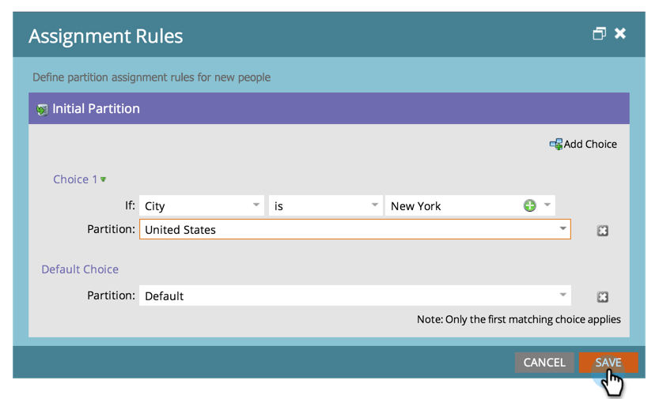

# 할당 규칙 {#assigning-person-partitions-with-assignment-rules}에 개인 파티션 할당

>[!NOTE]
>
>**관리자 권한 필요**

>[!PREREQUISITES]
>
>[개인 파티션 만들기](/help/marketo/product-docs/administration/workspaces-and-person-partitions/create-a-person-partition.md)

개인 파티션을 사용할 때는 할당 규칙을 설정하여 CRM에서 만든 사람을 각 파티션으로 라우팅합니다.

>[!NOTE]
>
>CRM과 SOAP API를 통해 Marketing To에서 만든 사람에게만 할당 규칙이 적용됩니다.

1. 관리에서 작업 영역 및 파티션을 클릭합니다.

   

1. **사용자 파티션** 탭에서 **할당 규칙**&#x200B;을 클릭합니다.

   

1. 사용자를 개인 파티션으로 라우팅하기 위한 조건을 추가하려면 **선택 추가**&#x200B;를 클릭합니다.

   

1. 조건을 빌드할 필드를 선택합니다.

   

1. 선택 연산자를 선택하고 값을 입력합니다.

   

1. 조건을 충족하는 사용자가 속할 사람 파티션을 선택합니다.

   

   >[!NOTE]
   >
   >원하는 만큼 선택할 수 있습니다.

1. **저장**&#x200B;을 클릭합니다.

   

여기 있다! 개인 파티션을 사람으로 채우는 규칙을 할당했습니다.

>[!NOTE]
>
>이전 조건이 충족되지 않으면 기본 선택이 적용됩니다.
