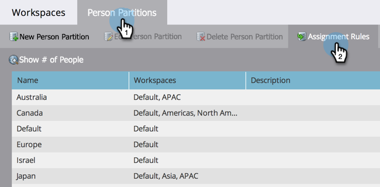

# 할당 규칙으로 개인 분할 영역 할당 {#assigning-person-partitions-with-assignment-rules}

>[!NOTE]
>
>**관리자 권한 필요**

>[!PREREQUISITES]
>
>[개인 파티션 만들기](/help/marketo/product-docs/administration/workspaces-and-person-partitions/create-a-person-partition.md)

개인 분할 영역을 사용할 때 CRM에서 생성된 사람을 해당 분할 영역으로 라우팅하는 할당 규칙을 설정합니다.

>[!NOTE]
>
>CRM과 SOAP API를 통해 Marketo에서 생성된 사람에게만 할당 규칙이 적용됩니다.

1. **[!UICONTROL Admin]** 영역으로 이동합니다.

   

1. **[!UICONTROL Workspaces & Partitions]**&#x200B;을(를) 클릭합니다.

   

1. **[!UICONTROL Person Partitions]** 탭에서 **[!UICONTROL Assignment Rules]**&#x200B;을(를) 클릭합니다.

   

1. **[!UICONTROL Add Choice]**&#x200B;을(를) 클릭하여 사용자를 개인 파티션으로 라우팅하는 조건을 추가합니다.

   

1. 조건을 빌드해야 하는 필드를 선택합니다.

   

1. 선택 연산자를 선택하고 값을 입력합니다.

   

1. 조건을 충족하는 사람들을 포함할 사람 파티션을 선택하십시오.

   

   >[!NOTE]
   >
   >원하는 만큼 선택할 수 있습니다.

1. **[!UICONTROL Save]**&#x200B;을(를) 클릭합니다.

   

여기 있었구나! 개인 파티션을 사람으로 채우기 위한 규칙을 할당했습니다!

>[!NOTE]
>
>이전 조건이 충족되지 않으면 기본값 선택 이 적용됩니다.
