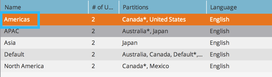

# Workspace 이름 변경 {#change-the-name-of-a-workspace}

>[!NOTE]
>
>**관리자 권한 필요**

>[!PREREQUISITES]
>
>[새 Workspace 만들기](/help/marketo/product-docs/administration/workspaces-and-person-partitions/create-a-new-workspace.md)

사용자는 작업 영역의 이름을 변경할 수 있습니다. 아주 간단합니다.

>[!NOTE]
>
>먼저 [작업 공간 및 개인 파티션 이해](/help/marketo/product-docs/administration/workspaces-and-person-partitions/understanding-workspaces-and-person-partitions.md)를 참조하십시오.

1. **[!UICONTROL Admin]** 영역으로 이동합니다.

   

1. **[!UICONTROL Workspaces & Partitions]**&#x200B;을(를) 클릭합니다.

   

1. Workspace을 선택하고 **[!UICONTROL Edit Workspace]**&#x200B;을(를) 클릭합니다.

   

1. Workspace의 새 **[!UICONTROL Name]**&#x200B;을(를) 입력하고 **[!UICONTROL Save]**&#x200B;을(를) 클릭합니다.

   

저장한 후 변경 사항이 표시됩니다.

