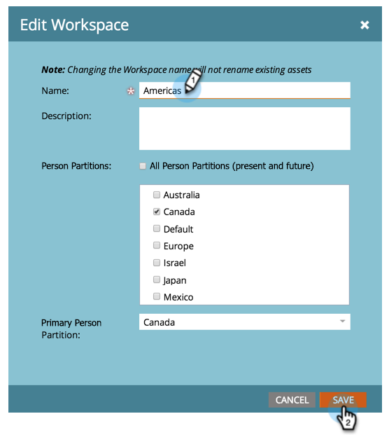

# 작업 공간 이름 변경 {#change-the-name-of-a-workspace}

>[!NOTE]
>
>**관리자 권한 필요**

>[!PREREQUISITES]
>
>[새 작업 공간 만들기](/help/marketo/product-docs/administration/workspaces-and-person-partitions/create-a-new-workspace.md)

사용자는 작업 영역의 이름을 변경할 수 있습니다. 아주 간단합니다.

>[!NOTE]
>
>을 사용하여 먼저 이해 [작업 공간 및 개인 분할 영역 이해](/help/marketo/product-docs/administration/workspaces-and-person-partitions/understanding-workspaces-and-person-partitions.md).

1. 로 이동 **관리자** 영역입니다.

   

1. 클릭 **작업 공간 및 파티션**.

   

1. 작업 영역을 선택하고 **작업 영역 편집**.

   

1. 새 항목 입력 **이름** 작업 공간에 대해 **저장.**

   

저장한 후 변경 사항이 표시됩니다.

