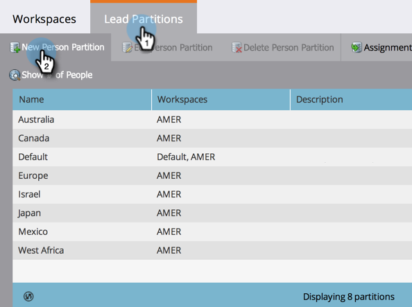

# 사람 파티션 만들기 {#create-a-person-partition}

다음 단계에 따라 새 개인 파티션을 만듭니다.

>[!NOTE]
>
>**관리자 권한 필요**

>[!NOTE]
>
>[작업 영역 및 개인 파티션 이해](/help/marketo/product-docs/administration/workspaces-and-person-partitions/understanding-workspaces-and-person-partitions.md)로 먼저 파악합니다.

>[!CAUTION]
>
>개인 파티션은 복잡할 수 있습니다. 설정을 위한 도움이 필요하면 [Marketing Support](https://nation.marketo.com/t5/Support/ct-p/Support)에 문의하십시오.

1. 관리에서 **작업 영역 및 파티션**&#x200B;을 선택합니다.

1. **사람 파티션** 탭으로 이동한 후 **새 인물 파티션**&#x200B;을 클릭합니다.

   

1. 파티션의 이름을 지정하고 작업 영역이 나타날 **작업 공간**&#x200B;을 선택하고 **만들기**&#x200B;를 클릭합니다.

   

   파티션을 만든 후 업데이트가 표시됩니다.

   

   여기 있어요! 이제 개인 파티션을 만드는 방법을 알 수 있습니다.
