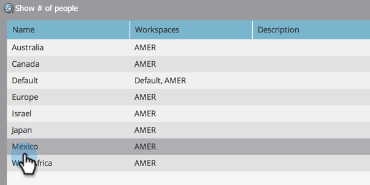

# 개인 파티션 만들기 {#create-a-person-partition}

다음 단계에 따라 새 개인 분할 영역을 만듭니다.

>[!NOTE]
>
>**관리자 권한 필요**

>[!NOTE]
>
>자세한 내용은 [작업 영역 및 개인 파티션 이해](/help/marketo/product-docs/administration/workspaces-and-person-partitions/understanding-workspaces-and-person-partitions.md)를 참조하십시오.

1. **[!UICONTROL Admin]** 영역으로 이동합니다.

   

1. **[!UICONTROL Workspaces & Partitions]**&#x200B;를 클릭합니다.

   

1. **[!UICONTROL Person Partitions]** 탭으로 이동하여 **[!UICONTROL New Person Partition]**&#x200B;을(를) 클릭합니다.

   

1. 파티션 이름을 지정하고 표시할 **[!UICONTROL Workspaces]**&#x200B;을(를) 선택한 다음 **[!UICONTROL Create]**&#x200B;을(를) 클릭합니다.

   

파티션을 만들면 업데이트가 표시됩니다.

