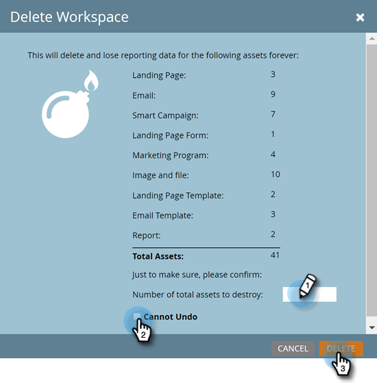

# 작업 영역 삭제 {#delete-a-workspace}

>[!NOTE]
>
>**관리자 권한 필요**

>[!NOTE]
>
>Marketo에서는 기본 작업 영역을 삭제할 수 없습니다.

1. **[!UICONTROL Admin]** 영역으로 이동합니다.

   

1. **[!UICONTROL Workspaces & Partitions]**&#x200B;를 클릭합니다.

   

1. 작업 영역을 선택하고 **[!UICONTROL Delete Workspace]**&#x200B;을(를) 클릭합니다.

   

1. 삭제하려는 자산 수(&quot;[!UICONTROL total assets]&quot; 옆에 나열됨)를 확인하고 **[!UICONTROL Cannot Undo]** 확인란을 선택한 다음 **[!UICONTROL Delete]**&#x200B;을(를) 클릭합니다.

   
