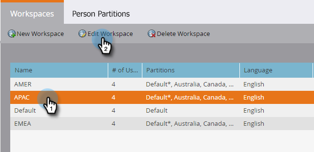

# 작업 영역 편집 {#edit-a-workspace}

작업 공간에서 변경해야 하는 경우가 있습니다. 쉬워요.

>[!NOTE]
>
>**관리자 권한 필요**

>[!NOTE]
>
>[작업 영역 및 개인 파티션 이해](/help/marketo/product-docs/administration/workspaces-and-person-partitions/understanding-workspaces-and-person-partitions.md)를 사용하여 작업 영역에서 브러시를 설정할 수 있습니다.

1. **관리**&#x200B;에서 **작업 영역 및 파티션**&#x200B;을 클릭합니다.

   

1. 편집할 작업 영역을 선택하고 **작업 영역 편집**&#x200B;을 클릭합니다.

   

1. 다른 리드 파티션을 선택하고 드롭다운에서 다른 기본 개인 파티션을 선택할 수 있습니다.

   >[!NOTE]
   >
   >필요한 경우 [더 많은 개인 파티션을 만들 수 있습니다](/help/marketo/product-docs/administration/workspaces-and-person-partitions/create-a-person-partition.md).

   

   >[!NOTE]
   >
   >**모든 개인 파티션** 확인란은 이 작업 공간이 시스템의 모든 리드 파티션을 사용할 수 있음을 의미합니다.

   >[!NOTE]
   >
   >**주 개인 파티션**&#x200B;은(는) 기본 역할을 하며 모든 사람을 할당할 위치입니다.

   여러 개의 브랜드 도메인을 활성화한 경우 다른 기본 브랜드 도메인으로 변경할 수 있습니다. **저장**&#x200B;을 클릭합니다.

   

   >[!NOTE]
   >
   >작업 영역 언어를 변경할 수 없습니다.

>[!MORELIKETHIS]
>
>* [새 작업 공간 만들기](/help/marketo/product-docs/administration/workspaces-and-person-partitions/create-a-new-workspace.md)
>* [작업 영역 및 개인 파티션 이해](/help/marketo/product-docs/administration/workspaces-and-person-partitions/understanding-workspaces-and-person-partitions.md)

