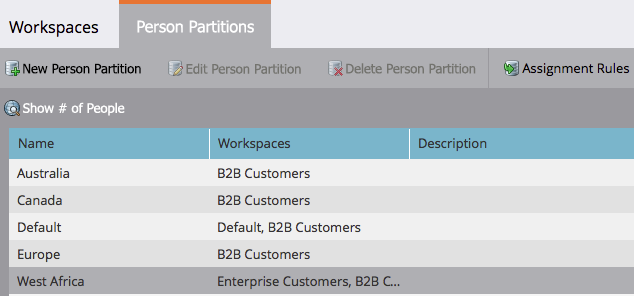

# 기존 개인 파티션 편집 {#edit-an-existing-person-partition}

개인 분할 영역은 두 번째(또는 세 번째) 데이터베이스를 갖는 것과 같습니다. 파티션을 하나 이상의 작업 공간에 연결할 수 있습니다.

>[!NOTE]
>
>**관리자 권한 필요**

>[!PREREQUISITES]
>
>[개인 파티션 만들기](/help/marketo/product-docs/administration/workspaces-and-person-partitions/create-a-person-partition.md){target="_blank"}

1. **[!UICONTROL Admin]** 영역으로 이동합니다.

   

1. **[!UICONTROL Workspaces & Partitions]**&#x200B;를 클릭합니다.

   

1. **[!UICONTROL Person Partitions]** 탭에서 편집할 개인 파티션을 선택하고 **[!UICONTROL Edit Person Partition]**&#x200B;을(를) 클릭합니다.

   

1. 개인 파티션 **[!UICONTROL Name]**, 해당 파티션이 속한 **[!UICONTROL Workspaces]**&#x200B;을(를) 입력하고 **[!UICONTROL Save]**&#x200B;을(를) 클릭합니다.

   

변경 사항을 저장하면 업데이트가 나타납니다.

