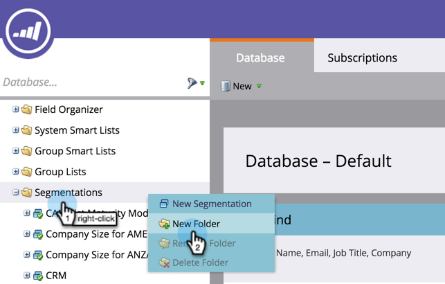
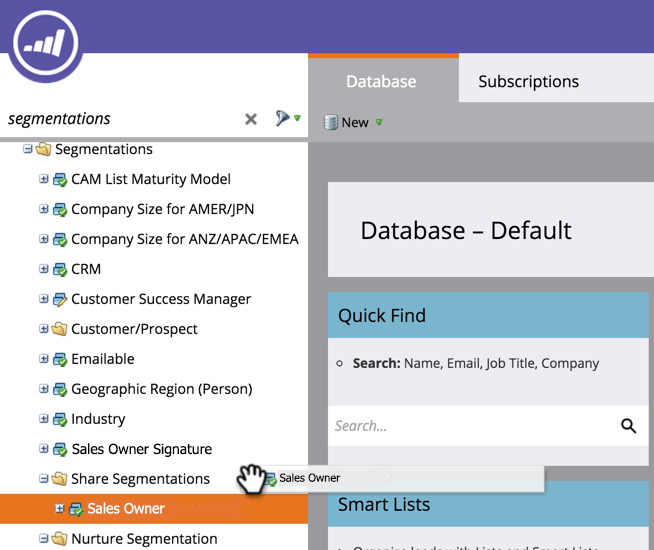

# 작업 영역 및 파티션 간에 세그먼트 공유 {#share-segmentations-across-workspaces-and-partitions}

>[!PREREQUISITES]
>
>이 문서는 작업 영역 및 파티션이 있는 고객에게만 해당됩니다.

## 세분화란 무엇입니까?{#whats-a-segmentation}

Marketing은 프로그램 또는 스마트 캠페인에 적합한 인물을 선택하는 데 유용합니다. 하지만 보다 영구적인 성향에 대해서는 세그먼트를 사용해야 합니다. Marketing To에서 고급 동적 컨텐츠를 사용해야 합니다.

>[!NOTE]
>
>**자세히 알아보기**
>
>[세그먼트를 만드는 방법에 대해 알아봅니다](../../../product-docs/personalization/segmentation-and-snippets/segmentation/create-a-segmentation.md).

이러한 페르소나를 설정한 경우(**및** 작업 영역을 사용) 작업 영역에서 공유할 수 있습니다. 다음은 알아야 할 몇 가지 유용한 정보입니다.

## 규칙 및 팁 {#rules-tips}

* 각 마케팅 구독은 여러 작업 영역에 대해 최대 20개의 세그먼트 &quot;합계&quot;를 포함할 수 있습니다(**작업 공간당 20개가 아님).**
* 액세스 권한이 있는 작업 영역에서만 세그멘테이션을 공유할 수 있습니다.
* 모든 파티션&#x200B;**에 대한 가시성이 있는**&#x200B;기본 작업 영역을 만들고 활용하십시오.

* 세그멘테이션 처리는 세그멘테이션이 생성된 작업 공간의 사람에게만 실행됩니다.

   * 기본 작업 영역에서 공유할 세그멘테이션을 만듭니다.

      * 세그멘테이션 승인
      * 공유 작업 영역에는 잠긴 폴더가 표시되고 세그멘테이션은 읽기 전용입니다.
      * 공유 버전은 편집할 수 없습니다. 원래 세그먼테이션이 만들어진 곳에서만 편집할 수 있습니다.
   * 공유 세그멘테이션 내에서 세그먼트(예: 의료)를 클릭하면 보고 있는 작업 공간과 연관된 파티션의 사람만이 표시됩니다.

      * 작업 공간 1(WS1)에서 세그멘테이션을 만들고 WS2와 공유하는 경우 WS1에서 WS2의 파티션에 액세스할 수 없는 경우 세그멘테이션이 다시 계산되지 않습니다.
      * 파티션이 제한된 작업 공간에서 세그멘테이션을 만든 다음 다른 작업 영역과 공유하는 경우 공유 세그멘테이션을 받은 작업 공간은 서로 겹치는 사람만 볼 수 있습니다.

>[!NOTE]
>
>이 규칙들 중 일부는 약간 복잡합니다. 가장 쉽게 시작하는 방법은 특정 사용자를 대상으로 테스트하는 것입니다. 항상 새로운 세그먼트를 만들고 이전 세그먼트를 제거할 수 있습니다.

## 예제 시나리오 {#example-scenarios}

** 

**

## 세그먼테이션 공유 {#share-a-segmentation}

1. 데이터베이스로 이동합니다.

   

1. 세그먼트를 마우스 오른쪽 단추로 클릭하고 새 폴더를 선택합니다.

   

1. 작업 영역 간에 공유할 폴더의 이름을 지정합니다(예:세그먼트 공유를 참조하십시오.)

   

1. 공유할 세그멘테이션을 폴더로 이동합니다.

   

1. 폴더를 마우스 오른쪽 단추로 클릭하고 [폴더 공유]를 선택합니다.

   

1. 폴더를 공유할 작업 영역을 선택합니다. 저장을 클릭합니다.

   

   >[!NOTE]
   >
   >이 대화 상자에는 볼 수 있는 권한이 있는 작업 영역이 표시됩니다. 이 때문에 Marketing에서는 모든 작업 영역 및 분할 영역에 대한 가시성이 있는 기본 작업 영역에서 세그먼트를 만들고 공유할 것을 권장합니다.

원래 폴더는 다른 작업 영역과 공유됨을 나타내는 화살표가 있는 데이터베이스 트리에 표시됩니다. 공유 작업 영역 내에서 폴더는 다른 작업 영역에서 폴더 내용이 공유되고 읽기 전용임을 나타내는 잠금과 함께 표시됩니다.

>[!NOTE]
>
>**관련 문서**
>
>[세그멘테이션 및 조각](http://docs.marketo.com/display/docs/segmentation+and+snippets)

