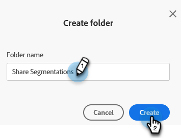
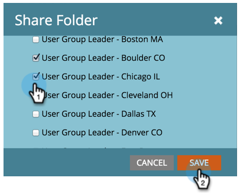

# 작업 영역 및 파티션 간 세분화 공유 {#share-segmentations-across-workspaces-and-partitions}

>[!PREREQUISITES]
>
>이 문서는 작업 공간 및 분할 영역이 있는 고객에게만 제공됩니다.

## 세그먼테이션이란? {#whats-a-segmentation}

Marketo은 프로그램이나 스마트 캠페인에 적합한 사람을 골라내는 데 능숙합니다. 그러나 보다 영구적인 가상 사용자는 세그먼테이션을 사용해야 합니다. Marketo에서 고급 동적 콘텐츠를 사용하는 데 필요합니다.

>[!NOTE]
>
>[세그먼트를 만드는 방법](/help/marketo/product-docs/personalization/segmentation-and-snippets/segmentation/create-a-segmentation.md)을 알아보세요.

이 가상 사용자를 설정하고 나면(_및_ 작업 영역을 사용) 해당 가상 사용자를 작업 영역에서 공유하게 됩니다. 다음은 알아 두어야 할 몇 가지 좋은 점입니다.

## 규칙 및 팁 {#rules-tips}

* 각 Marketo 구독에는 여러 작업 영역에 걸쳐 최대 20개의 &quot;총&quot; 세그먼테이션을 포함할 수 있습니다(**작업 영역당 20개가 아님**).
* 액세스 권한이 있는 작업 영역에서만 세분화를 공유할 수 있습니다.
* 모든 파티션에 대한 가시성이 있는 **기본 작업 영역을 만들고 활용하십시오**.

* 세그먼테이션 처리는 세그먼테이션이 만들어진 작업 공간의 사용자에게만 실행됩니다.

   * 기본 Workspace 내에서 공유할 세그먼테이션을 만듭니다.
      * 세분화 승인
      * 공유 작업 영역에 잠긴 폴더가 표시되고 세그먼테이션은 읽기 전용입니다.
      * 공유 버전은 편집할 수 없습니다. 만들어진 원래 세분화만 편집할 수 있습니다.

   * 공유 세그멘테이션 내에서 세그먼트(예: 의료)를 클릭하면, 표시되는 사람은 사용자가 보고 있는 작업 영역과 연결된 파티션의 사람만 됩니다.
      * WS1(Workspace 1)에서 세그먼테이션을 만들고 WS2와 공유하는 경우 WS1이 WS2용 파티션에 액세스할 수 없으므로 세그먼테이션이 다시 계산되지 않습니다.
      * 파티션이 제한된 작업 영역에서 세분화를 만든 다음 다른 작업 영역과 공유하는 경우 공유된 세분화를 수신한 작업 영역에는 겹치는 사람만 표시됩니다.

>[!NOTE]
>
>이러한 규칙 중 일부는 약간 복잡합니다. 시작하는 가장 쉬운 방법은 특정 사람들과 테스트하는 것입니다. 당신은 항상 새로운 세그먼테이션을 만들고 오래된 세그먼트를 제거할 수 있습니다.

## 예제 시나리오 {#example-scenarios}

## 세분화 공유 {#share-a-segmentation}

1. **[!UICONTROL Database]**(으)로 이동합니다.

   

1. **[!UICONTROL Segmentations]**&#x200B;을(를) 마우스 오른쪽 단추로 클릭하고 **[!UICONTROL New Folder]**&#x200B;을(를) 선택합니다.

   

1. 작업 영역 간에 공유할 폴더 이름을 지정하고(예: 세그먼트 공유) **[!UICONTROL Create]**&#x200B;을(를) 클릭합니다.

   

1. 공유할 세그먼테이션을 폴더로 이동합니다.

   

1. 폴더를 마우스 오른쪽 단추로 클릭하고 **[!UICONTROL Share Folder]**&#x200B;을(를) 선택합니다.

   

1. 폴더를 공유할 작업 영역을 선택합니다. **[!UICONTROL Save]**&#x200B;를 클릭합니다.

   

   >[!NOTE]
   >
   >이 대화 상자에는 볼 수 있는 권한이 있는 작업 공간이 표시됩니다. 따라서 Marketo에서는 모든 작업 공간과 분할 영역을 볼 수 있는 기본 작업 영역에서 세그먼트를 만들고 공유할 것을 권장합니다.

원래 폴더가 다른 작업 영역과 공유됨을 나타내는 화살표와 함께 데이터베이스 트리에 표시됩니다. 공유 작업 영역 내에서 폴더의 컨텐츠가 다른 작업 영역에서 공유되고 읽기 전용임을 나타내기 위해 잠금이 폴더에 표시됩니다.
