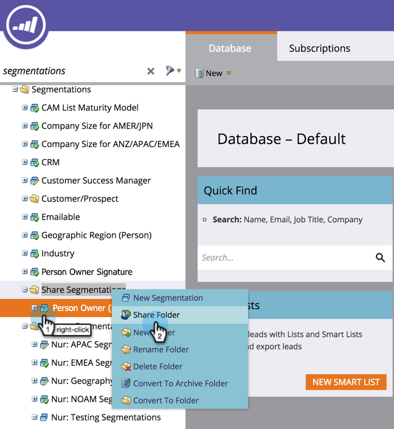

# 작업 영역 및 개인 파티션 이해 {#understanding-workspaces-and-person-partitions}

## 작업 영역 {#workspaces}

>[!CAUTION]
>
>작업 영역은 설정하기 복잡할 수 있습니다.  [Marketing Support](http://support.marketo.com/)에 문의하여 귀하에게 적합한지 알아보십시오.

작업 영역은 프로그램, 랜딩 페이지, 이메일 등과 같은 마케팅 자산을 보유하는 Marketing의 개별 영역입니다. 여러 사람이 사용할 수 있습니다. 각 사용자는 하나 이상의 작업 영역에 액세스할 수 있습니다.

>[!NOTE]
>
>**예**
>
>작업 공간을 사용할 수 있는 몇 가지 이유:
>
>* 지역:유럽, 아시아 및 북아메리카 마케팅 부서의 각 작업 영역 제공
>* 사업부:Quicken, Quickbooks 및 TurboTax에서 각각의 작업 영역을

>
>
각 경우 마케팅 자산이 완전히 다르기 때문에 분리됩니다. 마케팅 자산을 공유하는 경우 작업 영역이 사용자에게 적합한 도구가 아닐 수 있습니다.

>[!NOTE]
>
>**자세히 알아보기**
>
>[새 작업 공간](create-a-new-workspace.md)을 만드는 방법을 알아봅니다.

## 작업 영역 간 공유 {#sharing-across-workspaces}

다양한 작업 영역에서 에셋을 공유하는 방법을 살펴봅니다. 공유할 모든 것에도 동일하게 작동합니다.이 예는 세그먼트를 보여줍니다.

>[!NOTE]
>
>에셋이 포함된 상위 폴더는 하위 폴더가 아니라 공유할 수 있는 유일한 폴더입니다.

1. 새 폴더를 만듭니다.

   

1. 공유할 폴더의 이름을 지정합니다.

   

1. 공유할 자산을 폴더로 이동합니다.

   

1. 폴더를 마우스 오른쪽 단추로 클릭하고 **공유 폴더**&#x200B;를 선택합니다.

   

1. 폴더를 공유할 작업 영역을 선택하고 **저장**&#x200B;을 클릭합니다. [폴더 공유] 대화 상자에는 볼 수 있는 권한이 있는 작업 영역만 표시됩니다.

   

   >[!NOTE]
   >
   >이제 원래 폴더에 공유 폴더임을 나타내는 녹색 화살표가 표시됩니다. 공유 작업 영역에서 폴더에 읽기 전용이라는 자물쇠가 생깁니다.

이러한 항목을 작업 영역 간에 공유할 수 있습니다.

* 이메일 템플릿
* 랜딩 페이지 템플릿
* 모델
* 스마트 캠페인
* [스마트 목록](../../../product-docs/core-marketo-concepts/smart-lists-and-static-lists/using-smart-lists/reference-a-list-or-smart-list-across-workspaces.md)
* [세분화](share-segmentations-across-workspaces-and-partitions.md)
* 코드 조각

## 작업 영역 간 복제 {#cloning-across-workspaces}

템플릿이 아닌 에셋의 경우 프로그램 내에서 로컬 에셋으로 복제할 수 있습니다.  적절한 액세스 수준을 통해 이러한 자산을 다른 작업 영역으로 드래그하여 놓을 수 있습니다.

* 프로그램
* 이메일
* 랜딩 페이지
* Forms

>[!NOTE]
>
>템플릿이 있는 자산을 복제할 때 이러한 템플릿은 대상 작업 공간과 공유해야 합니다.

## 다른 작업 영역으로 자산 이동 {#moving-assets-to-other-workspaces}

에셋을 새 작업 영역으로 이동하려면 에셋을 폴더에 넣고 해당 폴더를 다른 작업 영역으로 드래그합니다.

>[!NOTE]
>
>한 작업 영역에서 다른 작업 영역으로 멤버를 포함하는 프로그램을 이동할 수 없습니다.

## 개인 파티션 {#person-partitions}

개인 파티션은 별도의 데이터베이스와 같습니다. 각 파티션에는 중복 제거 또는 다른 파티션과 혼합하지 않는 고유한 사용자가 있습니다. 동일한 이메일 주소를 사용하여 중복 레코드를 필요로 할 수 있는 비즈니스 사용 사례가 있을 경우 [Marketing To 지원](http://support.marketo.com)에 문의하십시오.

다음 구성에서 [작업 영역](create-a-new-workspace.md)에 개인 파티션을 할당할 수 있습니다.

* 하나의 작업 영역을 하나의 개인 분할 영역으로 변환(1:1)
* 여러 개인 파티션에 하나의 작업 영역(1:x)
* 여러 작업 영역을 하나의 개인 파티션에 지정(x:1)

>[!NOTE]
>
>**예**
>
>개인 파티션을 사용하는 이유:
>
>* 작업 영역에는 서로 다른 에셋뿐만 아니라 다른 사람도 공유하지 않습니다
>* 다른 사업상의 이유로 중복

>

>[!CAUTION]
>
>개인 파티션은 서로 상호 작용하지 않으므로 설정할 때는 주의하십시오.

>[!NOTE]
>
>**자세히 알아보기**
>
> [사람 파티션](create-a-person-partition.md)을 만드는 방법을 알아봅니다.

