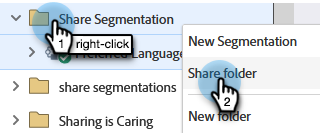

# 작업 영역 및 개인 파티션 이해 {#understanding-workspaces-and-person-partitions}

## 작업 공간 {#workspaces}

>[!CAUTION]
>
>작업 영역은 복잡하게 설정하여 설정할 수 있습니다. [Marketo 지원 센터](https://nation.marketo.com/t5/Support/ct-p/Support)에 문의하여 올바른 지원인지 확인하십시오.

작업 영역은 프로그램, 랜딩 페이지, 이메일 등과 같은 마케팅 에셋을 보유하는 Marketo의 개별 영역입니다. 여러 사람이 사용할 수 있습니다. 각 사용자는 하나 이상의 작업 공간에 액세스할 수 있습니다.

>[!NOTE]
>
>**예**
>
>작업 영역을 사용할 수 있는 몇 가지 이유:
>
>* 지역: 유럽, 아시아 및 북미 마케팅 부서는 각각 작업 공간을 확보합니다.
>* 사업부: [!DNL Quicken], [!DNL Quickbooks] 및 [!DNL TurboTax]이(가) 각각 작업 영역을 가져옵니다.
>
>각각의 경우 분리는 마케팅 자산이 완전히 다르기 때문입니다. 마케팅 에셋을 공유하는 경우 작업 공간은 사용자에게 적합한 도구가 아닐 수 있습니다.

>[!NOTE]
>
>[새 작업 영역을 만드는 방법](/help/marketo/product-docs/administration/workspaces-and-person-partitions/create-a-new-workspace.md)을 알아보세요.

## 작업 공간 간 공유 {#sharing-across-workspaces}

작업 공간 간에 자산을 공유하는 방법은 다음과 같습니다. 공유하고 싶은 모든 것에 대해서도 동일하게 작동합니다. 이 예제는 세그멘테이션을 보여 줍니다.

>[!NOTE]
>
>에셋을 포함하는 상위 폴더는 하위 폴더가 아니라 공유할 수 있는 유일한 폴더입니다.

1. **[!UICONTROL Database]**&#x200B;를 클릭합니다.

   

1. 세분화 폴더를 마우스 오른쪽 단추로 클릭하고 **[!UICONTROL New Folder]**&#x200B;을(를) 클릭합니다.

   

1. 폴더 이름을 지정하고 **[!UICONTROL Create]**&#x200B;을(를) 클릭합니다.

   

1. 공유할 자산을 폴더로 이동합니다.

   

1. 폴더를 마우스 오른쪽 단추로 클릭하고 **[!UICONTROL Share Folder]**&#x200B;을(를) 선택합니다.

   

1. 폴더를 공유할 작업 영역을 선택하고 **[!UICONTROL Save]**&#x200B;을(를) 클릭합니다. 폴더 공유 대화 상자에는 보기 권한이 있는 작업 공간만 표시됩니다.

   

   >[!NOTE]
   >
   >이제 원래 폴더에는 공유되었음을 나타내는 작은 녹색 화살표가 있습니다. 공유된 작업 공간에서는 폴더에 읽기 전용을 나타내는 자물쇠가 있습니다.

이러한 항목은 여러 작업 영역에서 공유할 수 있습니다.

* 이메일 템플릿
* 랜딩 페이지 템플릿
* 모델
* 스마트 캠페인
* [스마트 목록](/help/marketo/product-docs/core-marketo-concepts/smart-lists-and-static-lists/using-smart-lists/reference-a-list-or-smart-list-across-workspaces.md)
* [세분화](/help/marketo/product-docs/administration/workspaces-and-person-partitions/share-segmentations-across-workspaces-and-partitions.md)
* 스니펫

## 작업 영역 간 복제 {#cloning-across-workspaces}

템플릿이 아닌 에셋의 경우 프로그램 내에서 로컬 에셋으로 복제하는 것이 가장 좋습니다. 적절한 액세스 수준을 사용하여 다음 에셋을 다른 작업 영역으로 끌어다 놓을 수 있습니다.

* 프로그램
* 이메일
* 랜딩 페이지
* 양식

>[!IMPORTANT]
>
>위에 나열된 모든 항목은 작업 영역에서 복제할 수 있지만 전자 메일, 양식 및 랜딩 페이지 _은(는) 복제 시 프로그램 내에 있어야 합니다_.

>[!NOTE]
>
>템플릿이 있는 자산을 복제할 때 해당 템플릿을 대상 작업 공간과 공유해야 합니다.

## Assets을 다른 작업 공간으로 이동 {#moving-assets-to-other-workspaces}

자산을 새 작업 영역으로 이동하려면 해당 자산을 폴더에 넣고 폴더를 다른 작업 영역으로 드래그합니다.

>[!NOTE]
>
>구성원이 포함된 프로그램을 한 작업 영역에서 다른 작업 영역으로 이동할 수 없습니다.

## 개인 파티션 {#person-partitions}

개인 파티션은 별도의 데이터베이스처럼 작동합니다. 각 파티션에는 중복 제거를 수행하지 않거나 다른 파티션과 혼합되지 않는 고유한 사용자가 있습니다. 동일한 전자 메일 주소를 가진 중복 레코드가 필요한 비즈니스 사용 사례가 있는 경우 [Marketo 지원](https://nation.marketo.com/t5/Support/ct-p/Support)에 문의하십시오.

다음 구성에서 [작업 공간](create-a-new-workspace.md)에 개인 파티션을 할당할 수 있습니다.

* 한 작업 영역과 한 명의 사용자 파티션(1:1)
* 한 작업 공간에서 여러 사용자 파티션(1:x)
* 한 사람에 대한 많은 작업 영역 파티션(x:1)

>[!NOTE]
>
>개인 파티션을 사용해야 하는 이유:
>
>* 작업 공간에 다른 자산이 있을 뿐만 아니라 다른 사람도 공유하지 않습니다.
>* 다른 비즈니스 이유로 중복 항목을 원합니다.

>[!CAUTION]
>
>개인 파티션은 서로 상호 작용하지 않으므로 설정할 때 주의하십시오.

>[!NOTE]
>
>[개인 파티션을 만드는 방법](/help/marketo/product-docs/administration/workspaces-and-person-partitions/create-a-person-partition.md)을 알아보세요.
