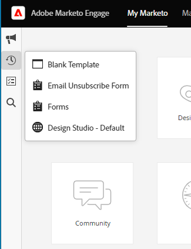

# Adobe Experience Cloud 인터페이스 개요 {#adobe-experience-cloud-interface-overview}

Adobe Experience Cloud 인터페이스는 Adobe Experience Cloud 애플리케이션 및 서비스의 &quot;쉘&quot; 룩과 느낌을 조정합니다. 하지만, 그것은 단지 새로운 디자인 그 이상입니다. 단일 인스턴스에서 사용자 경험을 제공하는 단일 페이지 애플리케이션입니다.

## 사용자 흐름 {#user-flow}

Adobe Experience Cloud 제품에 아직 로그인하지 않은 경우 [https://experience.adobe.com/marketo-engage](https://experience.adobe.com/marketo-engage)에서 직접 [!DNL Marketo Engage]에 로그인하십시오.

_are_&#x200B;이(가) 이미 Adobe Experience Cloud 제품에 로그인한 경우 메뉴 아이콘을 클릭하고 **[!DNL Marketo Engage]**&#x200B;을(를) 선택하면 됩니다.

>[!NOTE]
>
>구독 중인 Adobe Experience Cloud 제품에 따라 드롭다운 메뉴가 다르게 보일 수 있습니다.

## 새로운 기능 {#new-features}

업데이트된 모양과 느낌 외에도 다음과 같은 기능을 확인할 수 있습니다.

**통합 도움말 센터**

[!DNL Marketo Engage] 응용 프로그램 내에서 사용 가능한 다양한 도움말 리소스에 액세스합니다.

**응용 프로그램 전환기**

여러 Adobe 제품에 액세스할 수 있는 사용자는 이들 제품 간에 쉽게 전환할 수 있습니다.

**알림 및 공지**

애플리케이션에서 바로 제품별 알림 및 일반 Adobe 제품 공지를 보고 상호 작용할 수 있습니다.

**Adobe 설정**

Adobe 아이콘을 클릭하여 언어 또는 기타 프로필 전체 환경 설정을 변경합니다.

## FAQ {#faq}

**Experience Cloud 인터페이스를 통해 [!DNL Marketo Engage]에 로그인할 수 없습니다. 문제가 무엇일 수 있습니까?**

Adobe Experience Cloud에 로그인할 수 있지만 &quot;페이지 로드 실패&quot; 오류가 표시되는 경우 [!DNL Marketo Engage]측에서 문제가 발생할 수 있습니다. 도움이 필요하면 [Marketo 지원](https://nation.marketo.com/t5/support/ct-p/Support)에 문의하십시오.

**사용자 기록, 글로벌 검색, Marketo 알림 및 작업 트레이는 어디로 이동했습니까?**

이러한 기능은 Experience Cloud 인터페이스의 왼쪽 상단 탐색에서 새 막대로 이동되었습니다.

