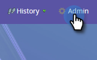

# Adobe 조직 매핑 설정 {#set-up-adobe-organization-mapping}

Audience Manager, B2B CDP Marketo 커넥터, [!DNL Dynamic Chat] 등과 같은 Adobe 애플리케이션과 동기화하려면 먼저 Marketo Engage에서 Adobe IMS 조직 자격 증명을 입력해야 합니다.

>[!NOTE]
>
>* HIPAA 지원 Marketo 인스턴스 배포에서는 이 통합을 사용할 수 없습니다.
>* 통합이 작동하려면 Marketo과 다른 Adobe 애플리케이션이 동일한 조직에 있어야 합니다.

>[!IMPORTANT]
>
>Adobe Business Platform 및 Identity Management System에 온보딩된 사용자의 경우 구독과 연결된 조직 ID가 이미 채워지고 읽기 전용 필드입니다. 따라서 이 문서의 단계는 적용되지 않습니다.

1. Marketo에서 **[!UICONTROL Admin]**&#x200B;을(를) 클릭합니다.

   

1. 통합에서 **[!UICONTROL Adobe Organization Mapping]**&#x200B;을(를) 클릭합니다.

   

1. **[!UICONTROL Edit]**&#x200B;를 클릭합니다.

   

1. Adobe IMS 조직 ID를 입력하고([여기](https://experienceleague.adobe.com/docs/control-panel/using/faq.html?lang=ko){target="_blank"}에서 찾는 방법 알아보기) **[!UICONTROL OK]**&#x200B;을(를) 클릭합니다.

   

1. **[!UICONTROL Confirm]**&#x200B;를 클릭합니다.

   

1. **[!UICONTROL Close]**&#x200B;를 클릭합니다.

   

   >[!IMPORTANT]
   >
   >보안상의 이유로 매핑하려는 Adobe 조직의 조직 관리자여야 합니다. 그렇지 않으면 작업이 실패합니다. 또한 Adobe 사용자 및 Marketo 사용자는 로그인할 때 동일한 이메일 주소를 사용해야 합니다.

1. _아직 로그인하지 않은_&#x200B;경우 새 탭/창에 팝업이 나타납니다. Adobe 조직에 로그인합니다(이 작업은 조직 액세스를 확인합니다).

이제 Adobe Experience Cloud에서 대상 데이터를 [공유](/help/marketo/product-docs/core-marketo-concepts/smart-lists-and-static-lists/static-lists/send-a-list-to-adobe-experience-cloud.md){target="_blank"}하거나 [대상 동기화](/help/marketo/product-docs/adobe-experience-cloud-integrations/sync-an-audience-from-adobe-experience-cloud.md){target="_blank"}할 수 있습니다.
