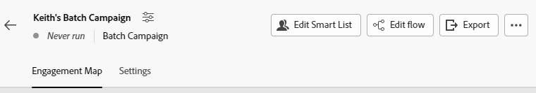

# 참여 맵 개요 {#engagement-map-overview}

참여 맵을 사용하면 스마트 캠페인을 직관적으로 시각화할 수 있습니다. 현재 기능의 손실 없이 기존의 모든 Marketo Engage 스마트 캠페인과의 완전한 이전 버전과의 호환성을 제공합니다.

>[!NOTE]
>
>참여 맵은 현재 스마트 캠페인에서 사용할 수 있습니다. 프로그램에서는 사용할 수 없습니다.

## 참여 맵 액세스 {#accessing-engagement-map}

기존 캠페인으로 이동하고 **참여 맵** 단추를 클릭합니다.

참여 맵에 두 개의 탭이 표시됩니다. [참여 맵](/help/marketo/product-docs/core-marketo-concepts/engagement-map/engagement-map-tab.md){target="_blank"} 및 [설정](/help/marketo/product-docs/core-marketo-concepts/engagement-map/settings-tab.md){target="_blank"}.

## 카드 설명 {#card-descriptions}

**트리거**: 트리거가 포함된 캠페인에서는 맵에 &quot;트리거 개요&quot; 카드가 있습니다. 이 아이콘을 클릭하면 각 트리거에 대한 카드와 추가 정보가 있는 슬라이드 아웃 패널이 표시됩니다.

**필터**: 필터가 포함된 캠페인에서는 맵에 필터 개요 카드가 포함됩니다. 클릭하면 각 필터에 대한 추가 정보가 있는 슬라이드 아웃 패널이 표시됩니다.

**흐름 단계**: 각 캠페인에는 각 흐름 단계에 대한 카드가 포함됩니다. 클릭하면 추가 정보가 있는 슬라이드 아웃 패널이 표시됩니다.

**선택 항목**: 흐름 단계에 하나 이상의 선택 항목이 포함되어 있는 경우 흐름 카드를 클릭하면 각 선택 항목에 대한 카드와 추가 정보가 포함된 슬라이드 아웃 패널이 표시됩니다.

## 중첩된 캠페인 {#nested-campaigns}

* 캠페인에 요청 또는 캠페인 실행 흐름 단계가 포함된 경우 흐름 카드를 클릭하면 호출되는 캠페인의 세부 정보와 추가 정보가 있는 슬라이드 아웃 패널이 표시됩니다.

* 캠페인에 선택 항목이 있는 요청 또는 캠페인 실행 흐름 단계가 포함된 경우 흐름 카드를 클릭하면 각 선택 항목에 대한 카드와 선택 항목에 대한 자세한 정보가 포함된 슬라이드 아웃 패널이 표시됩니다. 각 선택 카드를 클릭하면 호출되는 캠페인의 세부 정보와 자세한 정보가 포함된 슬라이드 아웃 패널이 표시됩니다.

* 또한 중첩된 캠페인에 요청 또는 캠페인 실행 흐름 단계가 있는 경우 흐름 카드를 클릭하면 캠페인의 세부 사항이 표시됩니다. 플로우 단계에 선택 사항이 포함된 경우에도 마찬가지입니다.

## 위쪽 탐색 {#top-navigation}

위쪽 탐색에는 다음 기능이 포함됩니다.

* 캠페인 이름 및 &quot;캠페인 편집&quot; 모달에 대한 액세스 권한을 여기에서 캠페인 이름 및 설명을 편집할 수 있습니다.

* 캠페인 상태 및 캠페인 유형은 캠페인 이름 아래에 반영됩니다.

* 트리거 캠페인에 대한 활성화/비활성화 버튼

* 스마트 목록 편집 - 필터 및/또는 트리거를 추가하거나 편집할 수 있는 새 탭에서 스마트 목록 인터페이스로 이동합니다

* 플로우 편집 - 플로우 단계를 추가하거나 편집할 수 있는 새 탭에서 플로우 인터페이스로 이동합니다

* 내보내기 - 캠페인 시각화의 이미지를 다운로드합니다. 다운로드한 버전은 확장한 분기를 반영합니다

* 캠페인 멤버 보기 - 캠페인 멤버 세부 정보가 포함된 새 탭이 열립니다.

>[!NOTE]
>
>열려 있는 스마트 목록 및 흐름 탭에서 수행된 변경 사항은 새로 고침 시 참여 맵 탭에 반영됩니다. 자동으로 업데이트되지 않습니다. 자동 저장된 업데이트 및 편집 내용은 참여 맵 탭을 새로 고칠 때 반영됩니다.

## FAQ {#faq}

**참여 맵에서 모든 캠페인을 다시 만들어야 합니까?**

아니. 참여 맵은 이전 버전과의 완전한 호환성을 가지고 있습니다. 버튼을 클릭하면 시각적 참여 맵 인터페이스에서 각 기존 캠페인을 볼 수 있습니다.

**Marketo Engage에 참여 맵을 사용하면 폴더 구조에 액세스할 수 없게 되고 스마트 캠페인을 만드는 방법을 다시 배워야 합니까?**

아니. Engagement Map의 가장 좋은 점은 두 세계의 장점을 모두 제공한다는 것입니다. 이는 캠페인을 구축하는 현재 방식과 상호 보완적입니다. 모든 사용자는 이제 명확한 비주얼로 보완된 Marketo Engage의 강력한 기능 세트를 계속 사용할 수 있습니다.

**참여 맵이 유료 추가 기능입니까?**

아니. 모든 구독에 있는 모든 기존 및 신규 Marketo Engage 사용자는 이 무료 기능에 액세스할 수 있습니다.

**Marketo Engage 관리자로서 참여 맵을 설정/해제해야 합니까?**

아니. 참여 맵은 해당 인스턴스의 모든 사용자가 사용할 수 있습니다. 특정 사용자, 작업 공간 등에 대해 이 기능을 켜거나 끌 수 없습니다.

**다른 비주얼 빌더와 어떻게 다릅니까?**

Engagement Map을 구분하는 세 가지 주요 사항은 다음과 같습니다.

* 유연성: 시각화를 통해 상호 연결되거나 깊게 중첩된 캠페인을 쉽게 관리하고 검증할 수 있습니다.

* 기능: 모든 시각적 요소가 기본 제공되어 사용하기 편리합니다. 중첩된 구조를 사용하여 전체 그림을 보고 가져올 수 있습니다.

* 전원: 기존의 모든 정교해진 Marketo Engage을 이제 시각적 형식으로 유지합니다.

>[!MORELIKETHIS]
>
>* [참여 맵 탭](/help/marketo/product-docs/core-marketo-concepts/engagement-map/engagement-map-tab.md){target="_blank"}
>* [설정 탭](/help/marketo/product-docs/core-marketo-concepts/engagement-map/settings-tab.md){target="_blank"}
