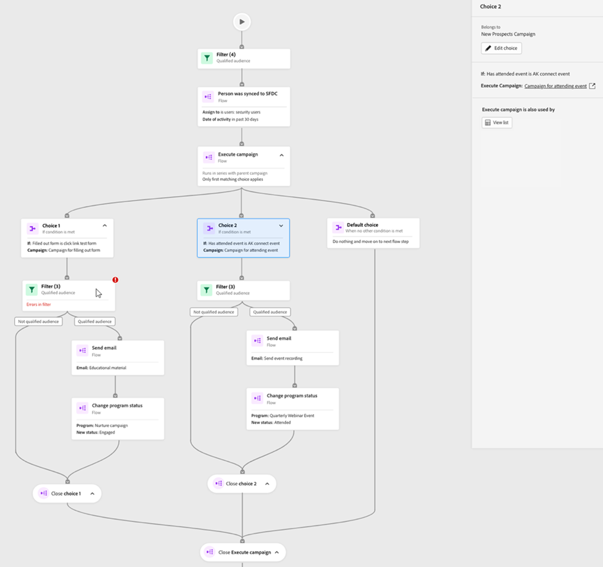

# 참여 맵 탭 {#engagement-map-tab}

참여 맵은 일련의 트리거, 필터 및 흐름 카드를 통해 표시됩니다. 각 카드를 클릭하면 추가 정보가 표시됩니다.

트리거 개요: 이 카드는 캠페인의 트리거 수를 보여 줍니다. 이 아이콘을 클릭하면 각 트리거에 대한 카드와 다음 정보가 있는 슬라이드 아웃 패널이 표시됩니다.

* 트리거가 속한 캠페인
* 트리거 이름 목록
* 트리거 편집

  

트리거 세부 사항: 이 카드에는 트리거 이름이 표시됩니다. 이 패널을 클릭하면 다음 정보가 포함된 슬라이드 아웃 패널이 표시됩니다.

* 트리거가 속한 캠페인
* 트리거와 연결된 제약 조건 목록
* 트리거 편집

필터: 이 카드를 클릭하면 다음 정보가 포함된 슬라이드 아웃 패널이 표시됩니다.

* 필터가 속한 캠페인
* 필터 자격이 있는 예상 사용자 수
* 필터 및 해당 제한 목록
* 필터 편집

  

흐름 단계: 흐름 단계에 선택 사항이 포함된 경우 이 카드에 흐름 단계의 이름이 표시됩니다. 이 패널을 클릭하면 다음 정보가 포함된 슬라이드 아웃 패널이 표시됩니다.

* 흐름 단계가 속한 캠페인
* 흐름 단계와 연관된 선택 조건 목록
* 플로우 단계 편집

흐름 단계: 흐름 단계에 선택 항목이 _포함되지 않음_&#x200B;이 포함된 경우 이 카드에 흐름 단계와 연결된 특성이 표시됩니다. 이 패널을 클릭하면 다음 정보가 포함된 슬라이드 아웃 패널이 표시됩니다.

* 흐름 단계가 속한 캠페인
* 흐름 단계와 연관된 속성 목록
* 플로우 단계 편집

  

## 캠페인 실행 및 요청을 위한 흐름 단계 {#flow-step-for-execute-and-request-campaigns}

* 실행 또는 요청 캠페인 흐름 단계에 선택 사항이 포함되지 않은 경우 카드에 캠페인의 이름이 표시됩니다. 카드를 클릭하면 다음 정보가 포함된 슬라이드 아웃 패널이 표시됩니다.

   * 흐름 단계가 속한 캠페인
   * 플로우 단계 편집
   * 흐름 단계와 연관된 속성 목록
   * 특정 요청/실행 캠페인을 사용하는 캠페인 목록을 여는 &quot;목록 보기&quot; 버튼

>[!NOTE]
>
>기본 캠페인에서 플로우 단계를 편집할 수 있습니다. 중첩된 캠페인을 편집하려면 슬라이드 아웃 패널의 링크를 통해 캠페인으로 이동해야 합니다.

* 캠페인 실행 또는 요청 흐름 단계에 선택 사항이 포함된 경우 카드를 클릭하면 다음 정보가 포함된 슬라이드 아웃 패널이 표시됩니다.

   * 흐름 단계가 속한 캠페인
   * 흐름 단계와 연관된 선택 조건 목록
   * 플로우 단계 편집

* 실행 또는 요청 캠페인에 선택 사항이 포함된 경우 흐름 카드를 클릭하면 개별 카드의 모든 선택 사항이 표시되도록 확장됩니다. _choice_ 카드를 클릭하면 특정 선택과 연결된 캠페인이 확장되고 다음 정보가 포함된 슬라이드 아웃 패널이 표시됩니다.

   * 선택 항목이 속한 캠페인
   * 선택 항목 편집
   * 흐름 단계와 연관된 선택 조건 목록
   * 목록 보기 - 특정 요청/실행 캠페인을 사용하는 캠페인 목록을 엽니다.

  

## 중첩 실행 캠페인 시각화 {#visualizing-a-nested-execute-campaign}

상위 캠페인과 직렬로 실행되는 캠페인을 실행합니다. 실행 가능한 캠페인의 자격이 있는 사람은 캠페인에서 모든 플로우 단계를 완료하고 기본 캠페인으로 돌아가 이 캠페인의 플로우 단계를 계속 진행합니다.

다음은 캠페인 흐름 실행 단계를 포함하는 스마트 캠페인 &quot;캠페인 A&quot;의 예입니다. &quot;캠페인 A&quot;를 기본 캠페인으로 생각해 보십시오.

1. 캠페인 실행 흐름 카드를 클릭하면 확장되어 &quot;캠페인 B&quot;에 대한 세부 정보가 표시됩니다.
1. &quot;캠페인 B&quot;에는 대상자를 자격이 있는 그룹과 자격이 없는 그룹으로 분할하는 필터가 포함되어 있습니다.
1. 적격 대상자는 &quot;캠페인 B&quot;와 연결된 흐름 단계를 거칩니다.
1. 모든 대상자(적격 및 비적격)는 &quot;캠페인 A&quot;로 돌아가 다음 흐름 단계로 이동합니다.

   

&quot;캠페인 B&quot;에서 캠페인 흐름 실행 단계를 클릭하면 각 선택과 연결된 선택 카드 및 캠페인이 표시됩니다.

## 요청 캠페인 시각화 {#visualizing-request-campaign}

요청 캠페인은 상위 캠페인과 동시에 실행됩니다. 요청 캠페인의 자격이 있는 사람은 캠페인에서 모든 흐름 단계를 완료한 다음 캠페인을 종료합니다. 동시에 동일한 사용자 세트는 기본 캠페인에서 플로우 단계를 거칩니다.

다음은 요청 캠페인 흐름 단계를 포함하는 스마트 캠페인 &quot;캠페인 A&quot;의 예입니다. &quot;캠페인 A&quot;를 기본 캠페인으로 생각해 보십시오.

1. 요청 캠페인 흐름 카드를 클릭하면 확장되어 &quot;캠페인 B&quot;에 대한 세부 정보가 표시됩니다.
1. &quot;캠페인 B&quot;에는 대상자를 자격이 있는 그룹과 자격이 없는 그룹으로 분할하는 필터가 포함되어 있습니다.
1. 적격 대상자는 &quot;캠페인 B&quot;와 연결된 흐름 단계를 거칩니다.
1. 동시에 모든 대상자는 &quot;캠페인 A&quot;의 다음 흐름 단계로 이동합니다.

   

흐름 단계에 다른 요청 캠페인이 포함된 경우, 흐름 카드를 클릭하여 캠페인의 세부 정보를 보고 중첩된 캠페인을 자세히 살펴볼 수 있습니다.

다음은 선택 항목이 있는 요청 캠페인의 예입니다.

## 오류 처리 {#error-handling}

스마트 목록 및 흐름 단계의 오류는 카드의 빨간색 아이콘을 통해 강조 표시됩니다. 또한 해당 오류 메시지가 슬라이드 아웃 패널에 반영됩니다.

스마트 목록 및 흐름 단계의 경고는 카드의 주황색 아이콘을 통해 강조 표시됩니다. 또한 해당 경고 메시지가 슬라이드 아웃 패널에 반영됩니다.

다음은 캠페인 실행 흐름 단계 카드, 슬라이드 아웃 패널 및 기본 선택 카드에 표시되는 선택 카드의 경고 예입니다.

>[!NOTE]
>
>경고는 검토해야 할 권장 사항이지만 스마트 캠페인의 오류를 나타내지는 않습니다.

**필터 카드의 오류에는 다음이 포함될 수 있습니다.**

* 적격 대상자가 표시되지 않는 스마트 목록 오류

* 필터 논리 오류

* 하나 이상의 필터에 제한 오류(또는 제한 없음)

  

>[!NOTE]
>
>중첩된 캠페인을 확장하기 위해 을(를) 클릭할 때까지 중첩된 캠페인 내의 오류가 표시되지 않습니다.
