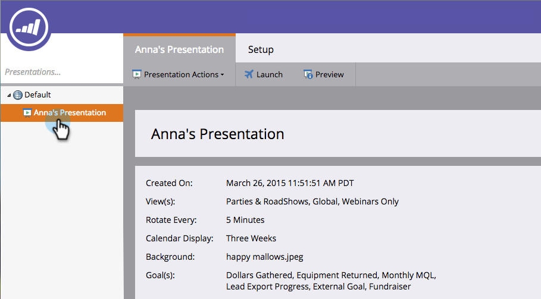

# 프레젠테이션 복제 {#clone-a-presentation}

다른 위치에서 재사용하기 위해 프레젠테이션을 복제합니다.

1. 복제할 프레젠테이션을 선택합니다.

   

1. 프레젠테이션을 마우스 오른쪽 단추로 클릭하고 **[!UICONTROL Clone]**&#x200B;을(를) 선택합니다.

   

1. 복제된 프레젠테이션의 이름을 입력하고 **[!UICONTROL Clone]**&#x200B;을(를) 클릭합니다.

   

   이제 프레젠테이션의 정확한 사본이 존재합니다.
