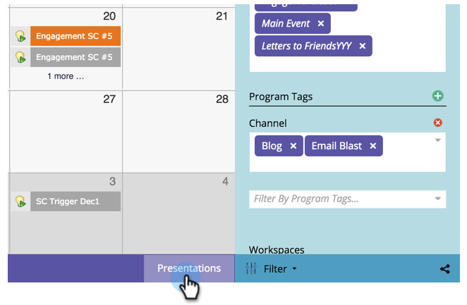
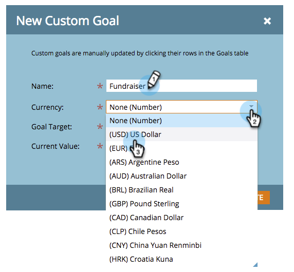

# 사용자 정의 목표 만들기 {#create-a-custom-goal}

목표는 진행 상황을 추적하고 팀에게 동기를 부여하는 방법입니다. 만든 후에는 수동으로 업데이트해야 합니다.

프레젠테이션과 마찬가지로 [작업 영역](/help/marketo/product-docs/administration/workspaces-and-person-partitions/understanding-workspaces-and-person-partitions.md)별 목표입니다.

1. **[!UICONTROL Calendar]**(으)로 이동합니다.

   

1. 오른쪽 아래 모서리에서 **[!UICONTROL Presentations]**&#x200B;을(를) 클릭합니다.

   

1. **[!UICONTROL Goals]** 탭을 선택합니다.

   

1. **[!UICONTROL Custom Goal]**&#x200B;을(를) 캔버스로 끌어서 놓습니다.

   

1. 목표의 이름을 입력합니다. **[!UICONTROL Currency]** 선택.

   >[!NOTE]
   >
   >목표가 금전적 가치가 아닌 경우 **[!UICONTROL None]**&#x200B;을(를) 선택할 수 있습니다.

   

1. **[!UICONTROL Goal Target]** 및 **[!UICONTROL Current Value]**&#x200B;의 값을 입력하십시오(값이 없으면 **0**&#x200B;을(를) 입력하십시오). 그런 다음 **[!UICONTROL Create]**&#x200B;를 클릭합니다.

   

   사용자 지정 목표가 생성되었습니다.

   
