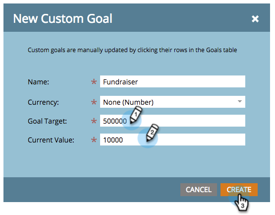

# 사용자 지정 목표 만들기 {#create-a-custom-goal}

목표는 진행 상황을 추적하고 팀에게 동기를 부여하는 방법입니다. 만든 후에는 수동으로 업데이트해야 합니다.

프레젠테이션과 마찬가지로 목표는 다음과 같습니다. [작업 영역](/help/marketo/product-docs/administration/workspaces-and-person-partitions/understanding-workspaces-and-person-partitions.md)특정.

1. 로 이동 **[!UICONTROL 캘린더]**.

   

1. 클릭 **[!UICONTROL Presentations]** 오른쪽 하단에 있습니다.

   

1. 다음 항목 선택 **[!UICONTROL 목표]** 탭.

   

1. 드래그 앤 드롭 **[!UICONTROL 사용자 정의 목표]** 캔버스에 넣었습니다.

   

1. 목표의 이름을 입력합니다. 선택 **[!UICONTROL 통화]**.

   >[!NOTE]
   >
   >목표가 통화 가치가 아닌 경우 다음을 선택할 수 있습니다. **[!UICONTROL 없음]**.

   

1. 다음에 대한 값을 입력하십시오. **[!UICONTROL 목표 Target]** 및 **[!UICONTROL 현재 값]** (없는 경우 다음을 입력하십시오.) **0**). 그런 다음 **[!UICONTROL 만들기]**.

   

   사용자 지정 목표가 생성되었습니다!

   
