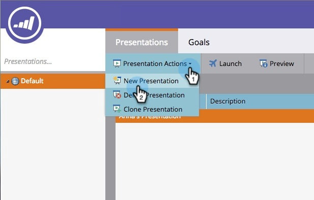

# 프레젠테이션 만들기 {#create-a-presentation}

팀의 달력 보기 및 목표를 HDTV에 투영할 프레젠테이션을 만듭니다. 프레젠테이션은 Workspace 전용입니다.

>[!AVAILABILITY]
>
>
>모든 Marketo Engage 사용자가 이 기능을 구입한 것은 아닙니다. 자세한 내용은 Adobe 계정 팀(계정 관리자)에 문의하십시오.

1. **[!UICONTROL Calendar]**(으)로 이동합니다.

   

1. 오른쪽 아래 모서리에서 **[!UICONTROL Presentations]**&#x200B;을(를) 클릭합니다.

   

1. **[!UICONTROL Presentation Actions]**&#x200B;을(를) 클릭하고 **[!UICONTROL New Presentation]**&#x200B;을(를) 선택합니다.

   

1. 프레젠테이션의 이름을 선택합니다. **[!UICONTROL Create]**&#x200B;를 클릭합니다.

   

   잘했어! 이제 프레젠테이션을 맞춤화할 준비가 되었습니다.

>[!MORELIKETHIS]
>
>[프레젠테이션 사용자 지정](/help/marketo/product-docs/core-marketo-concepts/marketing-calendar/calendar-hd/customize-a-presentation.md)
