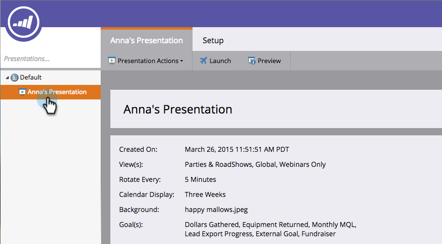

# 프레젠테이션 {#delete-a-presentation} 삭제

때로는 좋은 것을 너무 많이 가질 수도 있다. 이전 프레젠테이션을 삭제하여 새로운 프레젠테이션을 준비할 수 있습니다.

1. 프레젠테이션을 선택합니다.

   

1. 마우스 오른쪽 단추를 클릭하고 **삭제**&#x200B;를 선택합니다.

   

1. **삭제**&#x200B;를 클릭하여 확인합니다.

   

   포! 시야에서 벗어나 정신이 없다.

