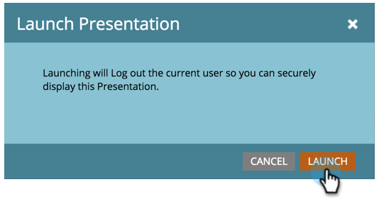

# 프레젠테이션 시작 {#launch-a-presentation}

프레젠테이션의 보기 횟수와 회전 빈도를 설정했으면 이제 시작할 차례입니다.

>[!AVAILABILITY]
>
>
>모든 Marketo Engage 사용자가 이 기능을 구입한 것은 아닙니다. 자세한 내용은 Adobe 계정 팀(계정 관리자)에 문의하십시오.

>[!PREREQUISITES]
>
>* [프레젠테이션 만들기](/help/marketo/product-docs/core-marketo-concepts/marketing-calendar/calendar-hd/create-a-presentation.md)
>* [프레젠테이션 사용자 지정](/help/marketo/product-docs/core-marketo-concepts/marketing-calendar/calendar-hd/customize-a-presentation.md)

>[!TIP]
>
>시작하기 전에 _프레젠테이션 미리 보기_&#x200B;를 확인하세요.

1. **[!UICONTROL Launch]**&#x200B;를 클릭합니다.

   

1. **[!UICONTROL Launch]**&#x200B;을(를) 한 번 더 클릭합니다. 이렇게 하면 프레젠테이션이 안전하게 표시될 수 있도록 Marketo에서 로그아웃됩니다.

   

   >[!TIP]
   >
   >프레젠테이션이 새 탭에서 실행됩니다. 필요한 경우 탭을 외부 모니터로 이동하여 표시하고 **[!UICONTROL Fullscreen]**&#x200B;을(를) 클릭합니다.
