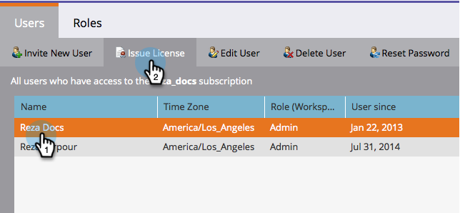

# 마케팅 달력 라이선스 {#issue-revoke-a-marketing-calendar-license} 문제/취소

>[!NOTE]
>
>**관리자 권한 필요**

[마케팅 달력](http://docs.marketo.com/display/docs/marketing+calendar) 시트를 사용하려면 액세스 권한이 필요한 사용자에게 라이선스를 발급해야 합니다. 방법

1. **관리** 섹션으로 이동합니다.

   

1. **사용자 및 역할**&#x200B;을 클릭합니다.

   

1. 사용자를 선택하고 **발행물 라이센스.**

   >[!TIP]
   >
   >한 번의 이동으로 여러 사용자를 선택하려면 **Ctrl/Cmd+클릭**&#x200B;을 사용하십시오.

   

1. **라이센스 활성화**&#x200B;를 선택하고 **저장을 클릭합니다.**

   >[!NOTE]
   >
   >라이선스는 5개로 제한됩니다. 더 필요한 경우 영업 담당자에게 문의하십시오.

   

   잘했다! **달력** 아래의 녹색 확인 표시를 참조하십시오.

   

굉장하다 - 일정을 잡을 준비가 되었습니다!
