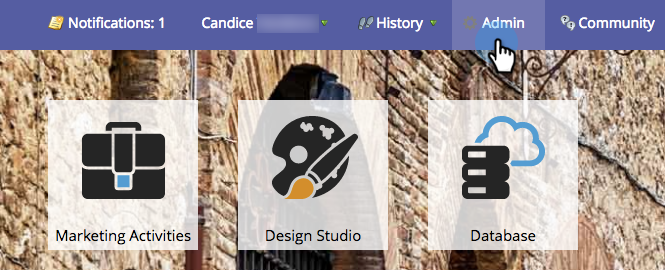

# 마케팅 캘린더 라이선스 발급/취소 {#issue-revoke-a-marketing-calendar-license}

>[!NOTE]
>
>**관리자 권한 필요**

[마케팅 일정](/help/marketo/product-docs/core-marketo-concepts/marketing-calendar/understanding-the-calendar/navigating-the-marketing-calendar.md){target="_blank"} 시트를 사용하려면 액세스 권한이 필요한 사용자에게 라이선스를 발급해야 합니다. 방법은 다음과 같습니다.

1. **[!UICONTROL Admin]** 섹션으로 이동합니다.

   

1. **[!UICONTROL Users & Roles]**&#x200B;를 클릭합니다.

   

1. 사용자를 선택하고 **[!UICONTROL Issue License]**&#x200B;을(를) 클릭합니다.

   >[!TIP]
   >
   >한 번에 여러 사용자를 선택하려면 **Ctrl/Cmd+클릭**&#x200B;하십시오.

   

1. **[!UICONTROL Enable License]**&#x200B;을(를) 확인하고 **[!UICONTROL Save]**&#x200B;을(를) 클릭합니다.

   >[!NOTE]
   >
   >라이센스는 5개로 제한됩니다. 더 필요한 경우 영업 담당자에게 문의하십시오.

   

   잘했어! &#39;[!UICONTROL Calendar]&#39; 아래의 녹색 확인 표시를 확인합니다.

   
