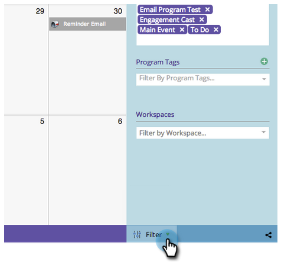

# 마케팅 달력 탐색 {#navigating-the-marketing-calendar}

마케팅 달력을 탐색하는 것은 1, 2, 3처럼 쉽습니다!

>[!PREREQUISITES]
>
>다음을 확인하십시오. [마케팅 달력 라이선스](/help/marketo/product-docs/core-marketo-concepts/marketing-calendar/understanding-the-calendar/issue-revoke-a-marketing-calendar-license.md) - 그렇지 않으면 마케팅 달력 타일이 내 Marketo에 표시되지 않습니다.

1. 로 이동합니다. **마케팅 달력**.

   

1. Marketo 인스턴스에 예약된 자산에 대한 조시 보기입니다.

   

## 모드 간 변경 {#change-between-modes}

1. 을(를) 클릭합니다. **3주** 또는 **월** 모드 간에 전환할 탭입니다.

   

## 안건 보기 사용 {#use-the-agenda-view}

안건 보기는 모든 항목을 목록으로 표시합니다.

1. 을(를) 클릭합니다. **필터 드롭다운**.

   

1. 을(를) 선택합니다 **의제** 보기.

   

   끝내줘! 이것은 계획된 모든 것을 보기 위한 훌륭한 보기입니다.

   

## 시간 탐색 {#navigate-through-time}

데로리안 없이! 탐색 버튼을 클릭하면 됩니다.

이러한 키보드 단축키를 사용할 수도 있습니다.

| 액션 | 키보드 단축키 |
|---|---|
| 다시 시간 | alt/opt + up |
| 정시 앞으로 | alt/opt + 아래쪽 |
| &quot;today&quot;로 이동합니다. | alt/opt + t |

끝내줘! 기본 사항은 다음과 같습니다. 필터를 사용하여 보기를 사용자 지정할 수도 있습니다.

>[!MORELIKETHIS]
>
>[마케팅 달력 필터링](/help/marketo/product-docs/core-marketo-concepts/marketing-calendar/working-with-the-calendar/filtering-the-marketing-calendar.md)
