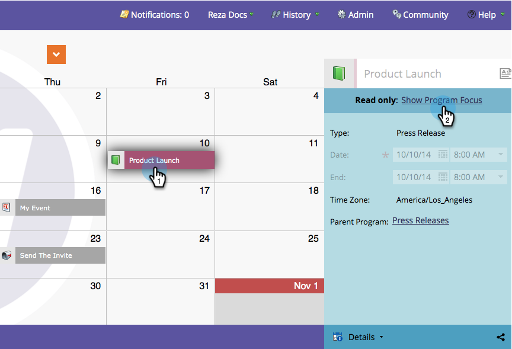

# 프로그램 포커스 이해 및 활성화 {#understand-enable-program-focus}

마케팅 캘린더에서는 사물을 한눈에 볼 수 있지만, 몇 가지 상호 작용도 가능합니다. 항목을 [만들기](/help/marketo/product-docs/core-marketo-concepts/marketing-calendar/working-with-the-calendar/create-entries-directly-in-the-marketing-calendar.md){target="_blank"}, [편집](/help/marketo/product-docs/core-marketo-concepts/marketing-calendar/working-with-the-calendar/edit-entries-directly-in-the-marketing-calendar.md){target="_blank"}, [삭제](/help/marketo/product-docs/core-marketo-concepts/marketing-calendar/working-with-the-calendar/delete-entries-directly-in-the-marketing-calendar.md){target="_blank"} 및 [확인](/help/marketo/product-docs/core-marketo-concepts/marketing-calendar/working-with-the-calendar/confirm-entries-directly-in-the-marketing-calendar.md){target="_blank"}할 수 있습니다. 항목과 상호 작용하려면 먼저 프로그램에 중점을 두어야 합니다.

1. **마케팅 일정**(으)로 이동합니다.

   

1. 항목을 선택하고 **[!UICONTROL Show Program Focus]**&#x200B;을(를) 클릭합니다.

   

1. 그 프로그램은 이제 &quot;보도 자료&quot;에 초점을 맞추고 있다.

   

   >[!NOTE]
   >
   >프로그램에 초점을 맞추면 프로그램에 속한 항목들과만 상호 작용하고 프로그램에 의해 저장될 새 항목을 만들 수 있습니다.

1. 작업이 완료되면 포커스를 해제하여 다른 프로그램 또는 항목과 상호 작용합니다.

   

아래 링크를 사용하여 항목과 상호 작용하는 방법을 알아보십시오.

>[!MORELIKETHIS]
>
>* [마케팅 일정에서 바로 항목 만들기](/help/marketo/product-docs/core-marketo-concepts/marketing-calendar/working-with-the-calendar/create-entries-directly-in-the-marketing-calendar.md){target="_blank"}
>* [마케팅 일정에서 바로 항목 편집](/help/marketo/product-docs/core-marketo-concepts/marketing-calendar/working-with-the-calendar/edit-entries-directly-in-the-marketing-calendar.md){target="_blank"}
>* [마케팅 일정에서 바로 항목 삭제](/help/marketo/product-docs/core-marketo-concepts/marketing-calendar/working-with-the-calendar/delete-entries-directly-in-the-marketing-calendar.md){target="_blank"}
>* [마케팅 일정에서 바로 항목 확인](/help/marketo/product-docs/core-marketo-concepts/marketing-calendar/working-with-the-calendar/confirm-entries-directly-in-the-marketing-calendar.md){target="_blank"}
