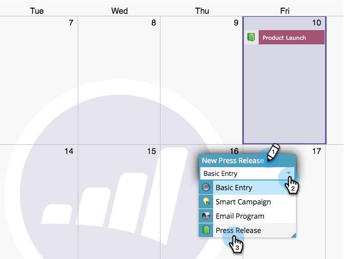

# 마케팅 달력 {#create-entries-directly-in-the-marketing-calendar}에서 직접 항목 만들기

Marketing에서는 프로그램 포커스 모드를 사용하여 마케팅 달력에서 직접 항목을 만들 수 있습니다. 다음과 같은 입력 유형을 만들 수 있습니다.

* 기본 항목
* 사용자 정의 항목
* 이메일 프로그램
* 스마트 캠페인

방법

1. **달력**&#x200B;으로 이동합니다.

   

1. 이전 항목을 선택하고 **프로그램 포커스 표시**&#x200B;를 클릭합니다.

   

1. 프로그램 포커스 모드에서 항목을 추가할 날짜를 선택합니다.

   

1. 항목의 이름을 지정하고 유형을 선택합니다.

   

   >[!TIP]
   >
   >이와 같은 방식으로 **스마트 캠페인**, **이메일 프로그램** 및 **기본 항목**&#x200B;을 만들 수도 있습니다.

1. 편집을 마치면 프로그램 포커스 모드를 닫습니다.

   

>[!MORELIKETHIS]
>
>[마케팅 달력에서 직접 항목 편집](edit-entries-directly-in-the-marketing-calendar.md)
