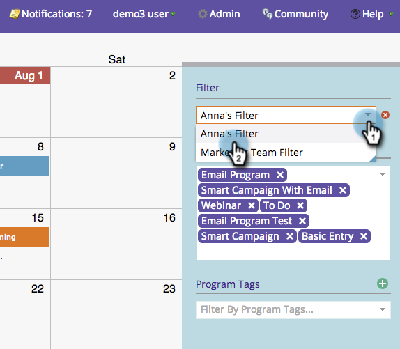

# 마케팅 달력에서 필터 정의 공유 {#sharing-a-filter-definition-in-the-marketing-calendar}

필터는 다른 사용자 간에 공유할 수 있습니다.

>[!PREREQUISITES]
>
>* [마케팅 달력에서 필터 만들기](/help/marketo/product-docs/core-marketo-concepts/marketing-calendar/working-with-the-calendar/filtering-the-marketing-calendar.md)
>* [마케팅 달력에서 필터 정의 저장](/help/marketo/product-docs/core-marketo-concepts/marketing-calendar/working-with-the-calendar/saving-a-filter-definition-in-the-marketing-calendar.md)

>[!NOTE]
>
> 저장된 필터를 변경하는 경우 반드시 다시 공유하십시오.편집한 내용은 다른 사용자에게 반영되지 않습니다.

1. 공유할 필터를 선택합니다.

   

1. 오른쪽 하단에 있는 공유 아이콘을 클릭합니다.

   

1. URL을 복사하고 다른 Marketing Cloud 사용자와 공유합니다.

   

   >[!NOTE]
   >
   >사용자 권한은 가시성에 영향을 줍니다.
