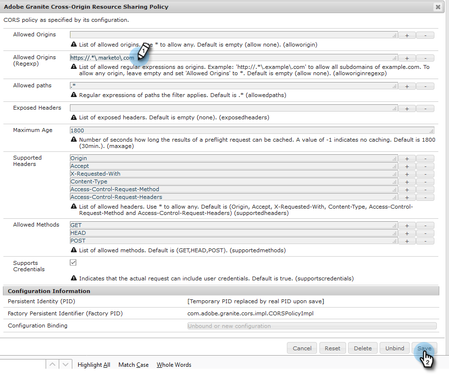

# Adobe Experience Manager 통합 구성 {#configuring-adobe-experience-manager-integration}

AEM 에셋에 액세스하고, 선택하고, Marketo Engage Design Studio로 가져올 수 있도록 AEM(Adobe Experience Manager)를 구성합니다.

>[!NOTE]
>
>**관리자 권한 필요**

>[!IMPORTANT]
>
>* 이 통합은 AEM의 온-프레미스 구현에서만 작동하며 AEM Cloud Service 구현에서는 지원되지 않습니다.
>
>* 현재 이 기능은 Firefox에서만 완전히 지원됩니다. 이 기능은 Safari에서 지원되지 않으며, SameSite 쿠키 설정에 따라 최신 버전의 Chrome에서 작동하지 않을 수 있습니다.

1. Adobe Experience Manager(회사별 URL)로 이동합니다.

   

1. Adobe으로 로그인하거나 로컬로 로그인할 수 있습니다. 이 예에서는 로컬로 로그인합니다.

   

1. **[!UICONTROL 도구]**&#x200B;에서 **[!UICONTROL 작업]**&#x200B;을 클릭하고 **[!UICONTROL 웹 콘솔]**&#x200B;을 선택하십시오.

   

1. 브라우저에서 &quot;Granite 원본 간 리소스 공유 Adobe&quot;(Windows의 경우 ctrl+f, Mac의 경우 cmd+f)을 검색합니다.

   

1. 오른쪽의 **+** 기호를 클릭합니다.

   

1. **[!UICONTROL 허용된 원본(Regexp)]** 텍스트 상자에 `https://.*\.marketo\.com`을(를) 입력하고 **[!UICONTROL 저장]**&#x200B;을 클릭합니다.

   

1. 페이지 상단의 헤더에서 **[!UICONTROL 웹 콘솔]**&#x200B;을 클릭하고 **[!UICONTROL 시스템 정보]**&#x200B;를 선택합니다.

   

1. 서버 정보에서 **[!UICONTROL 다시 시작]** 단추를 클릭합니다.

   

1. 확인하려면 **[!UICONTROL 확인]**&#x200B;을 클릭하세요.

   

1. Marketo Engage에서 **[!UICONTROL 관리자]**&#x200B;를 클릭합니다.

   

1. 통합에서 **[!UICONTROL Adobe Experience Manager]**&#x200B;을(를) 선택합니다.

   

1. **[!UICONTROL 편집]**&#x200B;을 클릭합니다.

   

1. AEM URL을 입력하고 **[!UICONTROL 확인]**&#x200B;을 클릭합니다.

   
