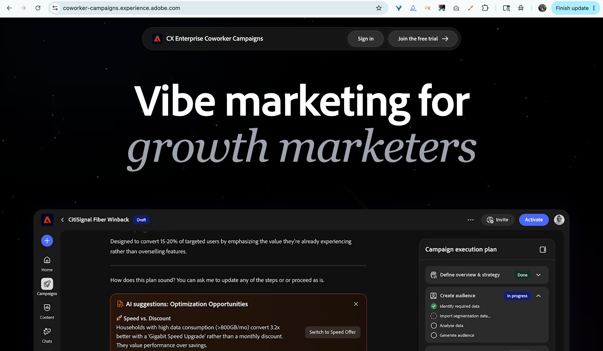

# CX Enterprise Coworker 개요 {#overview}

CX Enterprise Coworker 는 AI 기반의 마케팅 애플리케이션으로, 한 번의 프롬프트에서 검토 준비가 완료된 캠페인으로 전환됩니다.

## 액세스 방법

>[!NOTE]
>
>CX Enterprise Coworker는 2026년 9월 30일까지 무료 평가판을 통해 제공됩니다. 체험판 동안 모든 에셋 및 활동은 사용자에게만 해당됩니다.

1. coworker-essentials.experience.adobe.com으로 이동합니다.

1. 비즈니스 이메일을 사용하여 로그인하거나 계정을 만듭니다.

   기존 Adobe 고객은 자동 승인되며 평가판 환경으로 바로 라우팅되어 약관에 동의합니다.

   새 사용자에게 계정을 만들라는 메시지가 표시됩니다. CX Enterprise Coworker 팀이 요청을 검토하고 비즈니스 이메일을 승인합니다. 요청이 승인되면 이메일을 받게 됩니다.

1. 평가판 약관에 동의합니다.

1. **내 제품** > **브랜드**&#x200B;에서 브랜드를 설정합니다. CX Enterprise Coworker 는 사용자가 생성하는 모든 캠페인에 대해 이 값을 기본값으로 사용합니다.

1. (선택 사항) CX Enterprise Coworker용 **이메일 템플릿** 아래에 HTML 이메일 템플릿을 업로드하여 콘텐츠를 생성할 때 디자인을 적용합니다.

   

첫 번째 캠페인을 생성할 준비가 되었습니다.

## 인터페이스 둘러보기

CX Enterprise Coworker 인터페이스는 왼쪽 탐색을 중심으로 구성됩니다.

| 섹션 | 용도 |
|---|---|
| 새 채팅 | 캠페인을 생성하려면 새 대화를 시작하십시오. |
| 홈 | 시작 지점: 프롬프트 바, 최근 캠페인 및 준비된 캠페인 템플릿. |
| 채팅 | 시작한 모든 대화가 아직 캠페인 보드에 생성되지 않았습니다. |
| 캠페인 | 모든 초안 및 라이브 캠페인에 대한 인벤토리입니다. |
| 내 항목 | 브랜드 키트 및 이메일 템플릿(CX Enterprise Coworker가 모든 것을 브랜드로 유지하기 위해 사용하는 자산) |
| 사용자 지정 | 커넥터(론치 시 Marketo Engage) 및 스킬(캠페인 간에 적용할 수 있는 사용자 정의 비헤이비어). |

>[!NOTE]
>
>출시 당시 CX Enterprise Coworker의 모든 대화는 캠페인 생성에 중점을 둡니다. 관념화, 분석, 지원 방식의 대화는 점진적으로 전개될 것이다.

## CX Enterprise Coworker 로 수행할 수 있는 작업

CX Enterprise Coworker는 일반적으로 5개의 서로 다른 툴에 걸쳐 있는 5개의 워크플로우를 하나의 대화 환경으로 제공합니다.

- **간단한 내용을 캠페인 계획으로 변환**. 프롬프트에 드롭하거나 간단한 설명을 붙여 넣으면 CX Enterprise Coworker는 구조화된 전체 계획을 반환합니다.
- **대상을 빌드하고 세분화합니다**. CSV를 업로드하거나 데이터를 연결한 다음 대화에서 세그먼트를 세분화합니다.
- **브랜드 콘텐츠 생성**. CX Enterprise Coworker 는 사용자의 브랜드 음성, 참조 및 템플릿과 일치하는 이메일을 작성합니다.
- **여러 단계 여정 디자인**. CX Enterprise Coworker는 일회성 전송이 아닌 육성 시퀀스를 어셈블합니다.
- **증명 전자 메일 보내기**. 시작하기 전에 받은 편지함에서 모든 메시지를 미리 봅니다.
- **시작 및 분석**. _(준비 중)_ CX Enterprise Coworker를 종료하지 않고 캠페인을 전송하고 다음 단계에 대한 통찰력을 얻으십시오.

## AI 작동 방식

CX Enterprise Coworker는 간단한 멀티턴 대화 루프를 따릅니다.

**입력**. 캠페인 목표, 대상자(업로드 또는 연결) 및 선택적 브랜드 컨텍스트를 제공합니다.

**처리 중**. CX Enterprise Coworker agentic AI는 캠페인 플랜을 생성하고 여정을 빌드하며 개인화된 콘텐츠를 초안합니다.

**출력**. 초안 캠페인이 검토, 반복 및 최종 실행을 위해 캠페인 보드에 표시됩니다.

언제든지 CX Enterprise Coworker에 문의할 수 있으며(예: &quot;두 번째 이메일을 더 긴급하게 만들기&quot;, &quot;제목 줄을 줄이기&quot; 또는 &quot;3사분기부터 대상 고객을 종료된 고객으로 교체&quot;) 아티팩트가 업데이트됩니다.

>[!CAUTION]
>
>보내기 전에 항상 출력을 확인합니다.

## 시작하기 위한 팁

초기 사용자가 발견한 몇 가지 사항이 실제 차이를 만듭니다.

- **특정 실제 사용 사례로 시작**. &quot;90일 동안 주문하지 않은 고객을 위한 윈-백 시리즈&quot;가 &quot;나를 캠페인으로 만들어 줘&quot;를 이깁니다.&quot; 특정 예제는 _사용 사례_&#x200B;를 참조하세요.
- **대상 데이터 정리**. CX Enterprise Coworker는 CSV에서 허용하는 만큼 개인화만 가능합니다. 업로드하기 전에 이메일을 보내서는 안 되는 연락처 제외
- **브랜드 설정에 투자하세요**. CX Enterprise Coworker는 등록 시 브랜드 세부 정보를 추출합니다. **내 콘텐츠** > **브랜드**&#x200B;에서 생성한 모든 캠페인에 대한 빠른 검토.
- **증명 전자 메일 보내기**. 시작하기 전에 증명을 보내고 받은 편지함에서 검토하십시오.
- **반복, 다시 시작하지 않음**. CX Enterprise Coworker 의 첫 번째 출력을 시작점으로 취급합니다. 좋은 쪽으로 가는 가장 빠른 경로는 새로운 프롬프트가 아닌 몇 번의 개선 작업입니다.
- **종이 기록이 필요할 때 내보내기**. 팀 검토를 위해 개별 이메일을 HTML 또는 전체 캠페인을 Word 문서 또는 PDF으로 내보냅니다.

## 체험판에서 사용할 수 있는 사항

CX Enterprise Coworker 는 현재 개발 중인 제품입니다. 다음은 로그인하는 데 알아야 할 사항입니다.

- **평가판 기간**: 이제 2026년 9월 30일까지.
- **수락 필요**: 제품에 액세스하기 전에 평가판을 검토하고 동의해야 합니다.
- **전송 제한**: 월별 최대 5,000개의 전자 메일
- **대상자 제한**: 캠페인당 최대 10,000명의 연락처.
- **데이터 지침**: 중요한 데이터나 규제 대상 데이터를 업로드하지 마십시오. CX Enterprise Coworker 는 현재 HIPAA 규제 업종에 적합하지 않습니다.
- **준수**: 다음 전자 메일 규정(구독 취소 링크, 개인정보 처리방침 등)에 대한 책임이 있습니다.

새로운 기능은 평가판 중에 제공됩니다. 여러분의 피드백은 다음에 나올 것을 형성하는 데 도움이 됩니다. 제품 내 피드백 링크를 통해 피드백을 제출합니다.
