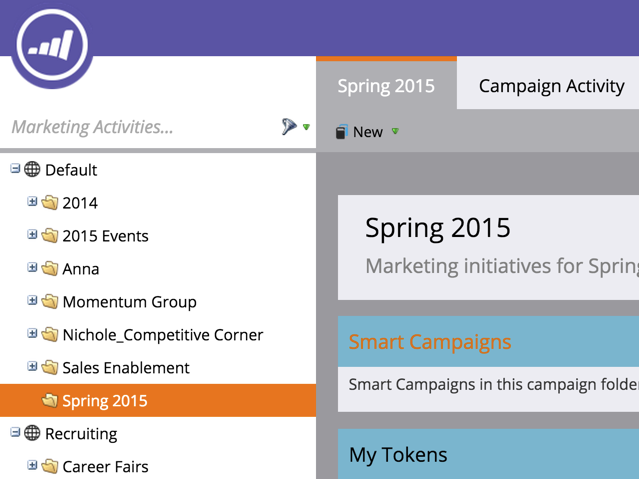

# 새 캠페인 폴더 만들기 {#create-new-campaign-folder}

캠페인 폴더를 사용하면 깔끔한 작업 공간을 유지할 수 있습니다. 이 간단한 단계들을 따라 자동화를 하는 중입니다.

1. 이동 **마케팅 활동**.

   

1. 선택 **새로 만들기**.

   

1. 선택 **새 캠페인 폴더**.

   

1. 을(를) 입력합니다. **이름** 캠페인 폴더에 배치합니다.

   

1. 선택 사항: 을(를) 입력합니다. **설명** 을(를) 클릭합니다. **만들기**.

   >[!TIP]
   >
   >구독에 있는 다른 사용자를 위한 설명입니다. 고객이 이 메시지를 볼 수 없습니다.

   

   끝내줘! 방금 캠페인 폴더를 빌드했습니다. 나무에서 확인해 보세요

   

   이제 [새 프로그램 만들기](/help/marketo/product-docs/core-marketo-concepts/programs/creating-programs/create-a-program.md), 이 캠페인 폴더를 옵션으로 볼 수 있습니다.

>[!MORELIKETHIS]
>
>* [프로그램 만들기](/help/marketo/product-docs/core-marketo-concepts/programs/creating-programs/create-a-program.md)
>* [새 스마트 캠페인 만들기](/help/marketo/product-docs/core-marketo-concepts/smart-campaigns/creating-a-smart-campaign/create-a-new-smart-campaign.md)

