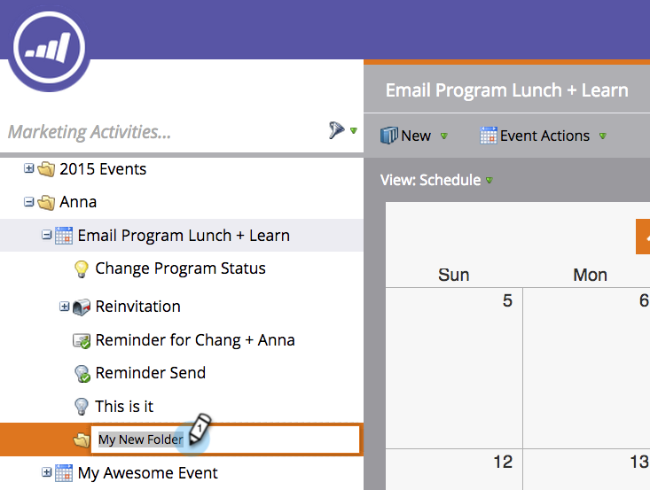

# 폴더 이해 {#understanding-folders}

프로그램 내의 폴더를 사용하여 스마트 캠페인 및 자산을 구성할 수 있습니다. 이는 [캠페인 폴더와 다릅니다](create-new-campaign-folder.md).

## 폴더 만들기 {#create-a-folder}

1. 마케팅 활동 **영역으로** 이동합니다.

   

1. 프로그램을 마우스 오른쪽 단추로 클릭하고 **새 폴더를 선택합니다**.

   

1. 새 폴더의 이름을 지정하고 Enter 키를 **누릅니다**.

   

좋아요! 이제 로컬 에셋을 저장할 새 폴더가 있습니다.

## 폴더 이름 변경 {#rename-a-folder}

마음을 바꾸어도 괜찮아요

1. 폴더를 마우스 오른쪽 단추로 클릭하고 폴더 이름 **변경을 선택합니다**.

   

1. 새 이름을 입력하고 Enter 키를 **누릅니다**.

   

   Et Volia! 폴더에 새 이름이 있습니다.

## 폴더 삭제 {#delete-a-folder}

>[!NOTE]
>
>폴더를 삭제하기 전에 해당 폴더가 비어 있는지 확인합니다.

1. 폴더를 마우스 오른쪽 단추로 클릭하고 폴더 **삭제를 선택합니다**.

   

   오디오 폴더!

## 폴더 보관 {#archive-a-folder}

Marketing에서는 기존 폴더를 보관 폴더로 변환할 수 있습니다. 보관 폴더는 마케팅 활동, 데이터베이스 및 디자인 스튜디오에 있습니다.

폴더를 보관하는 경우:

* 폴더 및 에셋이 더 이상 검색 결과에 표시되지 않습니다. 보관된 폴더 내에 있는 프로그램 또는 이벤트를 검색하면 보관된 폴더의 축소된 보기가 반환됩니다
* 폴더의 자산이 더 이상 자동 추천에 표시되지 않습니다.
* Design Studio에서 이메일 또는 랜딩 페이지를 만들 때는 보관된 템플릿을 사용할 수 없습니다
* 랜딩 페이지 테스트 그룹에는 보관된 페이지를 사용할 수 없습니다.

보관 시 변경되지 **않는** 기능:

* 전체 검색은 보관된 폴더에서 결과를 찾습니다.
* 사용 중인 자산은 보관 후에도 계속 작동합니다
* 필터를 사용하여 보고서에서 사용할 보관된 자산을 선택할 수 있습니다
* 보관된 자산은 비활성화되지 않습니다. 실행을 중지하도록 하려면 비활성화해야 합니다

