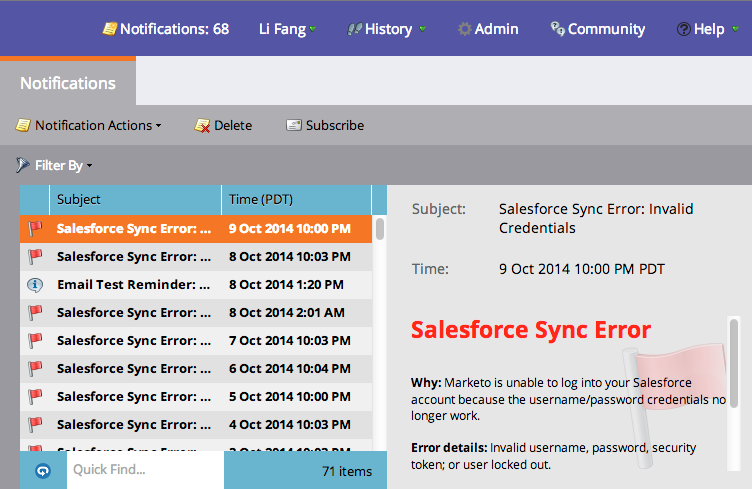

# 알림 이해 {#understanding-notifications}

알림은 마케팅 구독에서 발생하는 시스템 이벤트에 대한 최신 정보를 제공합니다. 예를 들어, 캠페인 실패 알림은 스마트 캠페인의 오류에 대해 알려주고 CRM 동기화 알림은 잘못된 권한 또는 동기화가 중단되는 등 CRM 동기화와 관련된 중요한 문제를 알려줍니다.

## 개요 {#overview}

1. 새 알림은 마케팅 오른쪽 상단에 표시됩니다.

   

1. 모든 알림을 보려면 알림을 클릭합니다.

   

## 알림 구독 {#subscribe-to-notifications}

알림에 가입하면 이메일로 받을 수 있습니다.

1. 알림으로 이동하고 가입을 클릭합니다.

1. 알림 유형을 선택하고 알림을 보낼 이메일 주소를 입력합니다.

   

>[!NOTE]
>
>경우에 따라 알림에서는 Microsoft Dynamics 동기화 오류 파일과 같은 쉼표로 구분된 값(CSV) 파일을 다운로드할 수 있는 &quot;전체 목록 보기&quot; 링크를 제공합니다. Marketing Cloud에서 이러한 CSV 파일을 30일 동안 유지합니다. 30일 이후에 파일을 다운로드하려고 하면 404 오류가 발생합니다.

>[!TIP]
>
>알림 이메일 구독을 취소하시겠습니까? 문제 없습니다. 이메일 하단에 있는 **알림** 링크를 클릭하면 됩니다.
