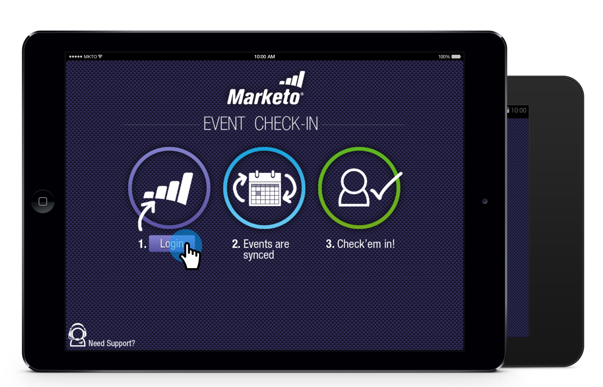

# 태블릿 {#check-people-into-your-event-from-your-tablet}에서 이벤트에 다른 사람을 체크 인합니다.

사람들이 이벤트에 나타나면 앱에서 해당 정보를 찾을 수 있습니다. 체크 인 후 Marketing To에 동기화하면 참석자 상태로 승격됩니다.

이 앱은 작은 레이아웃과 디자인 차이를 제외하고 iPad와 Android 모두에서 동일하게 작동합니다.

>[!PREREQUISITES]
>
>* Marketing에서 이벤트를 만들고 초대됨 및 등록된 사람으로 이벤트를 채웁니다.
>* [Android](https://play.google.com/store/apps/details?id=com.marketo.eventcheckin&amp;hl=en) 또는 [iOS](https://itunes.apple.com/us/app/marketo-events/id522766637?mt=8)용 태블릿 앱을 다운로드합니다.

## 등록된 손님 {#check-in-registered-guests} 체크 인

1. iPad 또는 Android 태블릿에서 앱 아이콘을 누릅니다.

1. **로그인**&#x200B;을 눌러 Marketing To 이벤트 앱을 시작합니다.

   

1. 마케팅 사용자 이름과 암호를 입력하고 **로그인**&#x200B;을 클릭합니다.

   >[!NOTE]
   >
   >앱에서 사람을 보려면 데이터베이스에 액세스할 수 있는 역할이 있어야 합니다.

1. **이벤트**&#x200B;를 선택합니다.

   

   >[!TIP]
   >
   >웨비나를 제외하고 1주일 전에 예약된 이벤트 프로그램 및 오늘 날짜 후 1주만 표시됩니다.

1. 홈 화면에서 등록된 손님을 찾습니다. 목록에서 인물을 찾으려면 다음을 수행할 수 있습니다.

   * 스크롤하여 이름 찾기
   * 검색 필드에 이름을 입력합니다.
   * 목록 오른쪽에서 성을 탭하여 성의 특정 초기 문자로 이동합니다.

   >[!NOTE]
   >
   >이 프로세스는 iPad와 Android에서 동일하지만 화면이 다르고 항목이 다른 위치에 있을 수 있습니다. 이 문서에서는 iPad 인터페이스를 제공합니다. 참조용으로 이 섹션의 Android 화면을 비교합니다.

   **iPad**

   

   **Android**

   

1. 선택한 이름을 누르고 개인 레코드에서 **체크 인**&#x200B;을 누릅니다.

   

이제 게스트는 [참석자] 상태를 가지며 확인 표시를 받습니다. Marketing To와 동기화하면 개인 레코드가 업데이트됩니다. [동기화] 단추의 빨간색 카운터는 Marketing To와의 마지막 동기화 이후 체크인 수를 표시합니다. [동기화] 단추는 다르게 보이고 iPad 및 Android의 다른 위치에 있습니다.

**iPad**

**Android**

>[!TIP]
>
>초대되었지만 등록하지 않은 사람은 검색 상자 바로 아래의 **서버 검색**&#x200B;을 클릭하여 이름을 검색할 수 있습니다. 초대됨 상태가 이벤트의 **참석**&#x200B;으로 변경됩니다.

## 태블릿 {#create-a-new-person-on-the-tablet}에 새 사람 만들기

Marketing 데이터베이스에 기존 사용자가 아닌 손님을 수동으로 추가할 수 있습니다. Marketing To와 동기화하면 자동으로 체크 인되어 데이터베이스에 추가됩니다.

1. **추가**&#x200B;를 클릭합니다.

   **iPad**

   

   **Android**

   

1. 가능한 많은 기본 정보 필드를 완료하고 **완료**&#x200B;를 탭합니다.

   

   >[!NOTE]
   >
   >기존 필드만 사용할 수 있습니다. 사용자 정의 항목을 만들 수 없습니다.

   >[!CAUTION]
   >
   >이메일 주소를 다시 확인합니다. 다른 필드는 나중에 수정할 수 있지만, 이메일 주소는 게스트에 연결하는 주요 방법입니다.

새 사람은 이벤트에 체크 인된 것으로 등록되며, Marketing To에 동기화할 때 참석자 상태가 있는 Marketing To 데이터베이스에 추가됩니다.

## 체크 인 {#reverse-a-check-in} 반전

MarketingTo _과(와) 동기화하기 전에 실수로 사람을 체크 인한 경우 [참석자] 상태를 되돌릴 수 있습니다._

1. 목록에서 이름을 누르고 사람 레코드에서 **실행 취소**&#x200B;를 누릅니다.

   

   모두 수정했습니다!

## 체크인 {#edit-a-person-record-at-check-in}에서 개인 레코드 편집

이벤트에서 바로 손님 정보를 추가하고 수정할 수 있습니다.

1. 사람 목록에서 이름을 누르고 **편집**&#x200B;을 누릅니다.

   

1. 정보를 편집하고 필드에 추가한 다음 **완료**&#x200B;를 누릅니다.

   

   >[!NOTE]
   >
   >Android에서 **완료** 단추가 숨겨질 수 있습니다. 아래로 스크롤하여 찾습니다.

앱을 Marketing To와 동기화하면 정보가 업데이트됩니다.

## 앱을 Marketing과 동기화 {#sync-the-app-with-marketo}

활동을 다시 Marketing To 데이터베이스에 동기화할 때까지 Marketing To 이벤트 앱이 독립적으로 작동합니다. 마지막 체크 인 후 가능한 한 빨리 동기화하는 것이 가장 좋습니다. 태블릿이 인터넷에 연결되어 있어야 합니다.

>[!CAUTION]
>
>동기화한 후에는 앱에서 체크 인을 되돌릴 수 없습니다.

1. 태블릿에서 앱을 열고 이벤트를 탐색합니다.

1. **동기화**&#x200B;를 누릅니다.

   이벤트가 Marketing To 데이터베이스의 새로운 체크인으로 업데이트됩니다. [동기화] 단추의 빨간색 카운터는 다른 사람을 확인할 때까지 지웁니다.

   보안상의 이유로 동기화가 완료되면 Marketing To Events 앱을 종료해야 합니다.

## 제한된 인터넷 액세스 작업 {#working-with-limited-internet-access}

일부 장소에서는 인터넷 접속이 안 된다. 다음 항목에 대한 적절한 연결이 필요합니다.

* 앱 다운로드 및 설치
* 로그인
* 이벤트 선택
* Marketing To와 앱 동기화

해당 장소의 인터넷 액세스가 걱정되는 경우 Marketing To Events 앱에 로그인하여 인터넷에 액세스할 수 있는 위치에서 이벤트를 미리 선택할 수 있습니다. 이렇게 하면 여전히 오프라인에서 앱을 사용할 수 있습니다. 그런 다음 인터넷 연결을 다시 받으면 Marketing To 데이터베이스와 바로 동기화합니다.

>[!TIP]
>
>인터넷에 연결되어 있지 않은 경우에도 체크 인할 사람을 새로 만들 수 있습니다. 앱을 동기화하면 기존 사람과 화해할 수 있습니다.

>[!NOTE]
>
>이 앱은 8시간 동안 활동이 없는 경우 자동으로 로그아웃됩니다.
