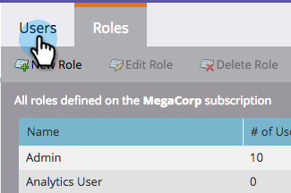

# 사용자에게 체크 인 앱에 대한 액세스 권한 부여 {#grant-users-access-to-the-check-in-app}

Marketing에는 이벤트 체크인 앱에 대한 특수 사용자 역할이 있습니다. 앱 사용 권한이 있는 새 역할을 만드는 방법을 설명합니다.

## 모바일용 새 사용자 역할 만들기 {#create-a-new-user-role-for-mobile}

1. 관리자를 **클릭합니다**.

   

1. 사용자 **및 역할을 클릭합니다**.

   

1. 역할 **탭을** 클릭한 다음 **새 역할을 클릭합니다**.

   

1. 새 역할의 이름과 선택적 설명을 입력합니다. 모바일 애플리케이션 **액세스** 상자를 선택하고 **만들기를 클릭합니다**.

   

   태블릿 앱을 사용하도록 사람을 초대하면 새 역할을 할당할 준비가 되었습니다.

## 체크 인 앱에 새 사용자 초대 {#invite-new-users-for-the-check-in-app}

1. 사용자 **탭을** 클릭합니다.

   

1. 새 사용자 초대**를 클릭합니다.

   

1. 새 사용자의 정보를 입력합니다. 모바일 앱에 액세스할 수 있는 권한이 있는 모든 해당 역할의 확인란과 새 역할을 선택합니다. 완료되면 **초대를** 클릭합니다.

   

   >[!CAUTION]
   >
   >데이터베이스에 액세스할 수 없는 사용자는 앱에 있는 사람을 볼 수 없습니다.

   >[!TIP]
   >
   >기존 사용자의 경우 새 역할을 만들거나 현재 역할에 Access Mobile 응용 프로그램 권한을 추가할 수 있습니다.

사용자는 로그인 앱에 액세스할 수 있다는 내용의 이메일을 수신하게 됩니다.