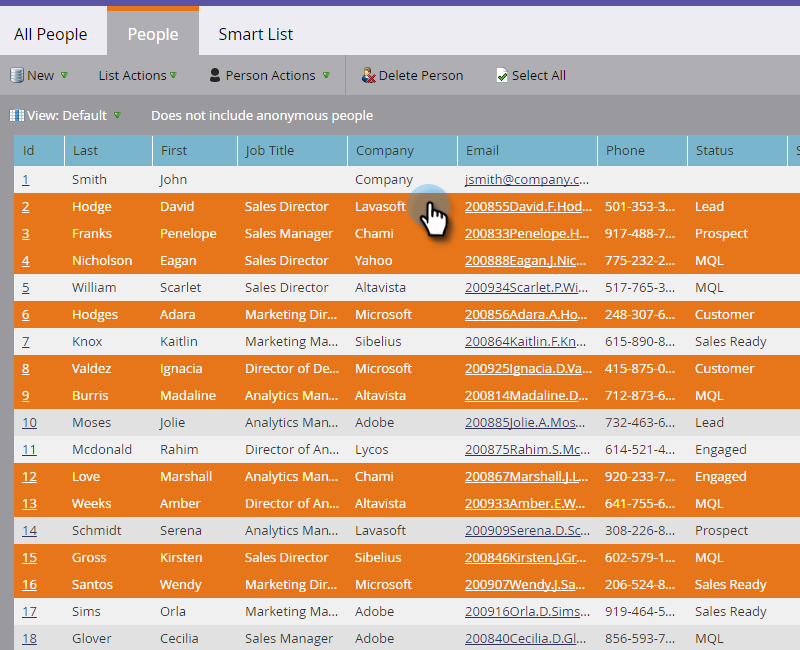
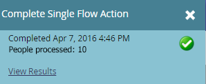

# 이벤트 {#prepare-for-your-event} 준비

이벤트를 준비하는 데 몇 가지 해야 할 일이 있습니다.

## 새 마케팅 역할 만들기 {#create-a-new-marketo-role}

Marketing에는 이벤트 체크인 앱에 대한 특수 사용자 역할이 있습니다. [모바일 응용 프로그램에 ](/help/marketo/product-docs/core-marketo-concepts/mobile-apps/event-check-in/grant-users-access-to-the-check-in-app.md) 액세스할 수 있는 권한을 사용하여 iPad 또는 Android 사용자를 위한 새 Marketing To Roleave를 만듭니다.

## 새 태블릿 사용자를 이벤트 {#invite-new-tablet-users-to-the-event}에 초대

[새 태블릿 사용자를 이벤트에 ](/help/marketo/product-docs/core-marketo-concepts/mobile-apps/event-check-in/grant-users-access-to-the-check-in-app.md) 초대하고 새 역할을 할당합니다.

## 새 마케팅 이벤트 프로그램 {#create-a-new-marketo-event-program} 만들기

[새로운 Marketing 이벤트 프로그램](/help/marketo/product-docs/demand-generation/events/understanding-events/create-a-new-event-program.md) 을 만들어 다양한 단계를 거쳐 진행 중인 사람들의 상태를 캡처하고 마케팅 이니셔티브에 대한 ROI를 정확하게 측정할 수 있습니다.

## 이벤트 날짜 {#specify-the-event-dates} 지정

이벤트 날짜를 설정하는 단축키입니다.

1. 일정에서 이벤트를 클릭하고 시작 및 종료 날짜와 시간을 설정합니다.

   

1. **미정**&#x200B;을(를) **확정**&#x200B;으로 변경하려면 밀어서 이동합니다.

   

   >[!CAUTION]
   >
   >이벤트 날짜가 현재 날짜 이전 또는 이후 1주 이상인 경우, 이벤트는 앱에 표시되지 않습니다. **팁**:테스트하려면 날짜를 임시로 오늘 1주 이내로 설정합니다. 이벤트를 테스트한 후 올바른 날짜로 되돌려야 합니다.

## 이벤트에 사람 추가 {#add-people-to-your-event}

이제 *when*&#x200B;을 알고 있으므로 *who*&#x200B;를 추가할 때입니다.

1. 이미 사람 목록이 있는 경우 내 마켓에서 **데이터베이스** 타일을 클릭합니다.

   

1. 사람이 있는 목록을 선택하고 **사람** 탭을 클릭합니다.

   

1. 목록에서 이벤트의 사람을 선택합니다. **Ctrl**(또는 Mac의 **Command**)을 사용하여 여러 사람을 클릭하거나, **모두 선택**&#x200B;을 사용하여 모든 사람을 표시합니다.

   

1. **사람 작업**&#x200B;을 클릭하고 **프로그램** 위로 마우스를 가져간 다음 **프로그램 상태 변경**&#x200B;을 선택합니다.

   

1. **프로그램** 드롭다운 목록을 클릭하고 이벤트를 선택합니다.

   

1. **새 상태** 드롭다운을 클릭하고 **로드쇼 > 등록됨**&#x200B;을 선택합니다. **지금 실행**&#x200B;을 클릭합니다.

   

1. 작은 창에 진행 상태가 표시됩니다..

   

1. ...작업이 언제 완료되었는지 나타냅니다.

   

   선택한 사람들이 이제 이벤트 진행 중이며, 무역 박람회 현장에서 태블릿 앱을 사용하여 체크 인할 준비가 되었습니다.
