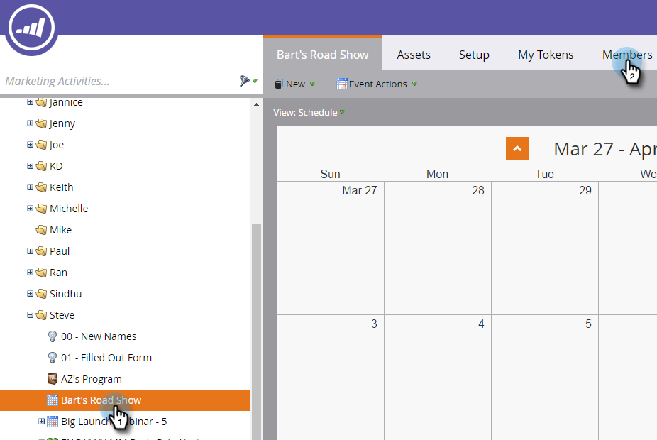

# iPad 또는 Android 태블릿 설정 {#set-up-the-ipad-or-android-tablet}

이벤트 날짜에 원활한 경험을 위해 iPad 또는 Android 태블릿을 준비하고 이벤트 전에 Marketing To Events 앱을 테스트합니다.

Marketing To에서 이벤트를 만들면 다음과 같은 경우 로그인할 때 Marketing To Events iPad 또는 Android 앱에 로드됩니다.

* 계정에 데이터베이스에 대한 액세스 권한이 있음
* 이벤트는 1주 전에 시작해서 현재 날짜 이후 1주 후에 끝나는 기간의 날짜에 예약됩니다
* 해당 채널에서 이벤트가 생성되었습니다(예: 로드쇼).

>[!NOTE]
>
>앱을 다운로드하려면 인터넷에 연결되어 있어야 합니다.

## Marketing To 이벤트 iPad 앱 다운로드 및 설치 {#download-and-install-the-marketo-events-ipad-app}

iPad에 아직 Marketing To Events 앱이 설치되어 있지 않은 경우 가져오는 방법은 다음과 같습니다.

1. iPad를 열고 App Store를 실행합니다.

   

1. 검색 상자에 **Marketing**&#x200B;을 입력하고 [제안]에서 **마케팅 이벤트**&#x200B;를 탭합니다.

   

1. 절차를 따라 iPad에 앱을 다운로드하고 설치합니다.

## Marketing To 이벤트 Android 앱 다운로드 및 설치 {#download-and-install-the-marketo-events-android-app}

Android 태블릿에 아직 Marketing To Events 앱이 설치되지 않은 경우 가져오는 방법을 설명합니다.

1. 태블릿을 열고 **Google Play Store** 앱을 탭합니다.
1. 검색 상자에 **Marketing**&#x200B;을 입력하고 **Return**&#x200B;을 누릅니다.
1. 검색 결과에서 **마케팅 이벤트** 앱을 탭합니다.

   

1. 절차에 따라 태블릿에 앱을 다운로드하여 설치하십시오.

## iPad 및 태블릿 사용자의 로그인 자격 증명 확인 {#confirm-login-credentials-for-ipad-and-tablet-users}

iPad 또는 태블릿을 사용하여 쇼 직원에게 할당하기 전에 사용자가 제대로 작동하는 로그인 자격 증명과 사용자의 이벤트가 앱의 홈 화면에 표시되는지 확인하십시오.

1. iPad 또는 태블릿에 대한 로그인 절차를 따라 로그인합니다.
1. 이벤트가 홈 화면에 표시되는지 확인합니다. 이 날짜는 현재 날짜 1주 전과 1주 이내인 경우에만 나타납니다.

   

   >[!NOTE]
   >
   >새 이벤트를 만든 후 iPad 또는 태블릿 앱에 표시되는 데 몇 분 정도 걸릴 수 있습니다. 나타나지 않으면 홈 화면에서 **로그아웃**&#x200B;을 누르고 몇 분 기다렸다가 다시 로그인합니다.

## 앱 동기화를 통해 이벤트 {#sync-the-app-to-populate-the-event} 채우기

동기화하여 추가한 사용자가 있는지 확인합니다.

1. iPad 또는 Android 앱에서 이벤트를 엽니다.
1. 사람들을 찾아봐 표시되지 않는 경우 **동기화**&#x200B;를 눌러 앱을 동기화하고 이벤트 사람 목록을 다시 로드하십시오.

   **iPad**

   

   **Android**

   

## 체크 인이 {#confirm-check-ins-are-working}을(를) 사용하고 있는지 확인

이벤트 전에 iPad 또는 태블릿에서 체크 인이 작동하는지 확인합니다.

1. 앱에서 [테스트 리드를 ](/help/marketo/product-docs/core-marketo-concepts/mobile-apps/event-check-in/check-people-into-your-event-from-your-tablet.md)에서 확인합니다.
1. **동기화** 아이콘을 눌러 앱을 동기화합니다.
1. Marketing에서 이벤트를 열고 **구성원**&#x200B;을 클릭합니다.

   

1. 사람의 상태가 **참석**&#x200B;으로 변경되었고 성공(Success)이 선택되었는지 확인합니다.

   

   >[!TIP]
   >
   >자신을 시험자로 이용하세요.
