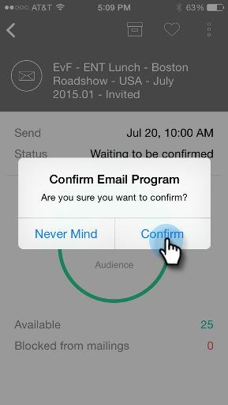

# 이메일 프로그램 카드 이해 {#understanding-email-program-cards}

Marketing To Moment를 사용하여 스마트폰 또는 iPad에서 이메일 프로그램을 볼 수 있습니다.

## 이메일 프로그램 카드 {#email-program-cards}

`<iframe width="420" height="315" src="https://www.youtube-nocookie.com/embed/n8JTSZI22Do" frameborder="0" allowfullscreen></iframe>` 이메일 프로그램 카드를 탭하면 다음 작업을 수행할 수 있습니다.

* [즐겨찾는 이메일 만들기](../../../../../product-docs/core-marketo-concepts/mobile-apps/marketo-moments/working-with-moments/creating-a-favorite.md)
* [완료한 대로 이메일 표시](../../../../../product-docs/core-marketo-concepts/mobile-apps/marketo-moments/working-with-moments/marking-it-done.md)
* [이메일 모멘트 카드 공유](../../../../../product-docs/core-marketo-concepts/mobile-apps/marketo-moments/working-with-moments/sharing-a-moment.md)

아직 전송되지 않은 이메일의 이메일 프로그램 카드에서 해당 이메일 프로그램의 상태와 고객에 대한 정보를 확인할 수 있습니다.

이메일이 전송되면 카드는 배달된 이메일 수, 받는 사람의 작업 및 캠페인에 사용된 스마트 목록에 대한 링크 등 다른 중요한 정보를 표시합니다.

## 이메일 카드 확인 {#confirming-an-email-card}

1. 확인되지 않은 이메일 카드를 확인하려면 세 개의 점 메뉴를 누릅니다.

   

1. 확인을 **누릅니다**.

   

1. **확인 **을 눌러 작업을 완료하거나 **다른 의견을** 가진 경우 신경 쓰지 마십시오.

   

   >[!NOTE]
   >
   >이제 카드가 주황색으로 바뀝니다!

## 이메일 카드 보내기 취소 {#canceling-an-email-card-send}

1. 확인된 이메일을 보내지 않으려면 세 개의 점 메뉴를 누릅니다.

   

1. 전송 **취소를 누릅니다**.

   

## 이메일 카드 예약 {#rescheduling-an-email-card}

확인 또는 확인 되지 않은 이메일 카드의 날짜를 다시 잡을 수 있습니다.

>[!NOTE]
>
>이미 확인된 이메일의 경우 먼저 이메일을 취소해야 합니다(아래 참조).

1. 이메일 일정을 다시 잡으려면 세 개의 점 메뉴를 누릅니다.

   

1. 예약 **을 누릅니다**.

   

1. 달력에서 날짜를 선택하고 예약 **을 누릅니다**.

   

   무선 서비스만 있으면 어디든지 일정을 조정할 수 있습니다

## 샘플 보내기 {#sending-a-sample}

이메일의 샘플을 다른 사람과 직접 공유할 수 있습니다.

1. 카드 메뉴를 엽니다.

   

1. 샘플 **보내기를 누릅니다**.

   

1. 이메일 주소를 입력하고 샘플 **보내기를 클릭합니다**.

   

## 이메일 미리 보기 {#previewing-an-email}

이메일 카드를 마우스 오른쪽 버튼으로 클릭하여 미리 볼 수 있습니다.

1. 이메일 **미리 보기를 누릅니다**.

   

   이렇게 하면 방아쇠를 당기기 전에 이메일이 완벽하다는 것을 알 수 있습니다.\
   

   훌륭해!

이메일 캠페인 보기 관련 정보 이제, 당신은 전문가입니다!

>[!MORELIKETHIS]
>
>* [마케팅 모멘트 이해](understanding-marketo-moments.md)
>* [이벤트 카드 이해](understanding-event-cards.md)
>* [분석 카드 이해](understanding-analytics-cards.md)
>* [이메일 프로그램](http://docs.marketo.com/display/docs/email+programs)

>

