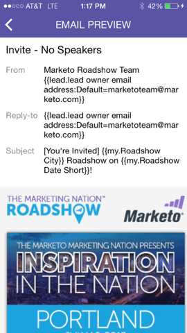

# 이메일 프로그램 카드 이해 {#understanding-email-program-cards}

Marketo 모멘트를 사용하여 휴대폰 또는 iPad에서 이메일 프로그램을 봅니다.

## 이메일 프로그램 카드 {#email-program-cards}

이메일 프로그램 카드를 탭하면 다음 작업을 수행할 수 있습니다.

* [즐겨찾기로 이메일 만들기](/help/marketo/product-docs/core-marketo-concepts/mobile-apps/marketo-moments/working-with-moments/creating-a-favorite.md)
* [전자 메일을 완료된 것으로 표시](/help/marketo/product-docs/core-marketo-concepts/mobile-apps/marketo-moments/working-with-moments/marking-it-done.md)
* [전자 메일 모멘트 카드 공유](/help/marketo/product-docs/core-marketo-concepts/mobile-apps/marketo-moments/working-with-moments/sharing-a-moment.md)

아직 전송되지 않은 이메일의 이메일 프로그램 카드에서 해당 이메일 프로그램의 상태 및 대상에 대한 정보를 확인할 수 있습니다.

이메일이 전송되면 카드에는 배달된 이메일 수, 수신자의 작업 및 캠페인에 사용된 스마트 목록에 대한 링크 등 다른 중요한 정보가 표시됩니다.

## 이메일 카드 확인 {#confirming-an-email-card}

1. 확인되지 않은 이메일 카드를 확인하려면 세 개의 점 메뉴를 탭합니다.

   

1. 탭 **확인**.

   

1. 탭 **확인** 작업을 마치려면 또는 **신경 쓰지 않음** 다시 생각해 보면

   

   >[!NOTE]
   >
   >이제 카드가 주황색으로 바뀝니다!

## 이메일 카드 보내기 취소 {#canceling-an-email-card-send}

1. 확인된 이메일을 보내지 않기로 결정한 경우 세 개의 점 메뉴를 누릅니다.

   

1. 탭 **보내기 취소**.

   

## 이메일 카드 다시 예약 {#rescheduling-an-email-card}

확인 또는 확인되지 않은 이메일 카드를 다시 예약할 수 있습니다.

>[!NOTE]
>
>이미 확정된 이메일의 경우 먼저 이메일을 취소해야 합니다(아래 참조).

1. 전자 메일 일정을 예약하려면 세 개의 점 메뉴를 누릅니다.

   

1. 탭 **다시 예약**.

   

1. 달력에서 날짜를 선택하고 탭합니다. **다시 예약**.

   

   무선 서비스가 있는 한, 어느 곳에서든지 일정을 조정할 수 있습니다!

## 샘플 보내기 {#sending-a-sample}

이메일 모멘트 샘플을 다른 사람과 직접 공유할 수 있습니다.

1. 카드 메뉴를 엽니다.

   

1. 탭 **샘플 보내기**.

   

1. 전자 메일 주소를 입력하고 **샘플 보내기**.

   

## 이메일 미리 보기 {#previewing-an-email}

이메일 카드를 마우스 오른쪽 단추로 클릭하여 미리 봅니다.

1. 탭 **이메일 미리 보기**.

   

   이런 식으로 방아쇠를 당기기 전에 이메일이 완벽하다는 것을 알 수 있습니다!

   

   훌륭해요!

이메일 캠페인을 보는 것도 좋습니다. 이제, 당신은 프로야!

>[!MORELIKETHIS]
>
>* [Marketo 모멘트 이해](/help/marketo/product-docs/core-marketo-concepts/mobile-apps/marketo-moments/understanding-moments/understanding-marketo-moments.md)
>* [이벤트 카드 이해](/help/marketo/product-docs/core-marketo-concepts/mobile-apps/marketo-moments/understanding-moments/understanding-event-cards.md)
>* [Analytics 카드 이해](/help/marketo/product-docs/core-marketo-concepts/mobile-apps/marketo-moments/understanding-moments/understanding-analytics-cards.md)

