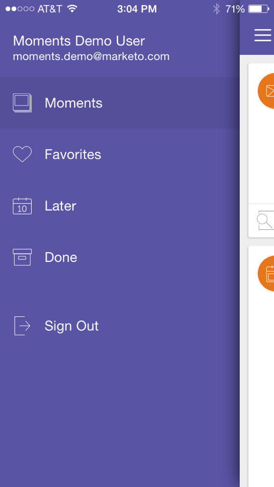
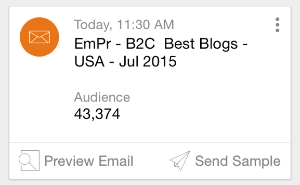
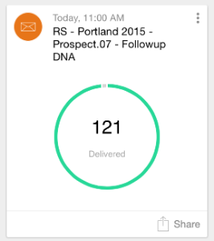
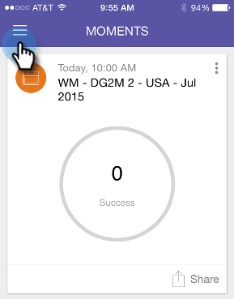

# 마케팅 모멘트 이해 {#understanding-marketo-moments}

Marketing의 강력한 기능 휴대폰 또는 iPad에서 바로 이메일을 미리 보고 다시 예약합니다.

>[!NOTE]
>
>**가용성**
>
>모바일 앱 액세스 권한이 필요합니다. 역할을 [업데이트하려면 마케팅 관리자에게 문의하십시오](../../../../../product-docs/administration/users-and-roles/managing-user-roles-and-permissions.md).

## 모멘트 소개 {#introducing-moments}

`<iframe width="420" height="315" src="https://www.youtube-nocookie.com/embed/IJfpzE8l73E" frameborder="0" allowfullscreen></iframe>`

## 스트림 {#streams}

다음은 &quot;Moment&quot;의 다양한 스트림입니다.

>[!NOTE]
>
>**정의**
>
>순간들 - 지금 막 달렸거나, 막 달아날 예정인 것은 모두 여기로 갑니다.
>
>즐겨찾기 - 즐겨찾기를 만드는 모든 것이 여기에 표시됩니다.
>
>나중에 - 이 순간보다 늦게 일어나는 모든 것이 여기에 들어갑니다.
>
>완료 - 실행을 완료했거나 완료된 것으로 표시한 모든 것이 여기에 표시됩니다.

좋아요, 이제 그 일이 터졌으니, 전화로 Markto Moments를 한번 만나봅시다!

## 세 종류의 카드 {#three-kinds-of-cards}

마케팅 모멘트는 이메일의 진행 상황을 파악할 수 있는 세 개의 서로 다른 카드를 제공합니다.

**온데크** - 이 이메일은 곧 발송됩니다. 미리 보거나 샘플을 전송하거나 필요한 경우 취소할 수 있는 마지막 기회입니다.

**박자** - 이메일 전달 그리고 여기 통계도 있습니다. 공유하십시오.

**결과** - 이메일 사용 방법 이메일 실행이 끝나면 결과 카드에 참여 점수 및 기타 통계가 표시됩니다.

## Moments Stream {#moments-stream}

앱을 처음 열거나 메뉴에서 **모멘트를** 누르면 관련 카드가 먼저 표시됩니다. 각 제품에는 특정 마케팅 이니셔티브와 전반적인 성과에 대한 정보가 포함되어 있습니다.

카드를 누르면 세부 사항 화면이 열립니다.

>[!NOTE]
>
>오렌지 카드가 확인되었습니다.회색지역은 잠정적입니다.

세 개의 점을 누르면 카드 동작 메뉴가 열립니다.

좋아요! 이제 다음을 탭하여 작업을 만들 수 있습니다.

>[!NOTE]
>
>**정의**
>
>* 즐겨찾기:가장 시기 적절하고 중요한 요소를 즐겨찾기로 만들면 해당 항목에 손쉽게 집중할 수 있습니다.
>* 완료:Done을 사용하면 Marketing To Moment 보기에서 정보를 얻을 수 있습니다(하지만 Marketing To에서는 안전하고 사운드 유지).
>* 공유:팀원에게 동기를 부여하거나 축하할 이미지를 보냅니다.
>* 샘플 보내기(이메일만):이메일을 보내기 전에 다른 사람이 이메일의 모양을 확인할 수 있도록 합니다.
>* 이메일 미리 보기(이메일만):이메일을 미리 확인해 보는 것은 항상 좋은 생각입니다.

>

## 나중 순간 {#later-moments}

나중에 섹션은 향후 활동을 보여줍니다.

1. 햄버거 메뉴를 눌러 시작합니다.

   >[!NOTE]
   >
   >세계 [기네스북에](http://www.guinnessworldrecords.com/world-records/largest-hamburger)따르면 세계 최대 햄버거는 2014파운드.

   

1. 나중에 **를 누릅니다**.

   

   예정된 활동 목록을 참조하십시오.

   

## 이메일 프로그램 카드 {#email-program-cards}

이메일 프로그램 카드에는 점심 시간에 나가더라도 일정, 고객, 상태 등 유용한 정보를 제공합니다.

## 이벤트 카드 {#event-cards}

이벤트의 경우 총 구성원 수와 해당 상태를 확인할 수 있습니다.

## 분석 카드 {#analytics-cards}

Analytics Moment 카드에서는 다음 기간 동안 이메일 및 이벤트가 월정액 성과를 보여줍니다.

1. 획득 리드
1. 새 리드
1. 구독 취소

## 스마트 캠페인 실행 카드 {#smart-campaign-run-cards}

스마트 캠페인 카드는 캠페인의 단일 실행을 나타냅니다. 스마트 캠페인을 실행할 때마다 새 카드가 나타납니다. 사용된 스마트 목록 필터, 캠페인 흐름 및 캠페인에 사용된 각 이메일을 보려면 을 누릅니다.

## 작업 확인 또는 취소 {#confirm-or-cancel-an-action}

모든 단계에서 작업을 확인하거나 취소할 수 있습니다. 마음이 바뀌면 마음만 **을 누르세요**.

자세한 내용

>[!MORELIKETHIS]
>
>* [이메일 프로그램 카드 이해](understanding-email-program-cards.md)
>* [이벤트 카드 이해](understanding-event-cards.md)
>* [분석 카드 이해](understanding-analytics-cards.md)
>* [스마트 캠페인 카드 이해](understanding-smart-campaign-cards.md)

>

## 지원되는 버전  {#supported-versions}

Marketing Momms는 다음과 같은 운영 체제 버전을 지원합니다.

* Apple iOS 8.0 이상
* Android 버전 4.1 이상(기본적으로 젤리빈과 업).

