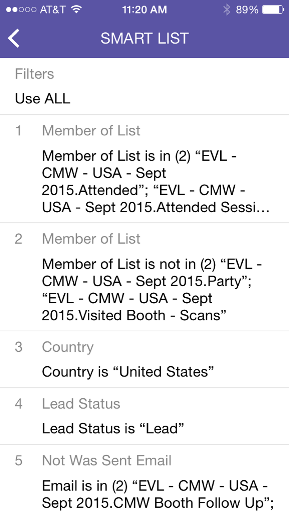

# 스마트 캠페인 카드 이해 {#understanding-smart-campaign-cards}

Marketo 모먼트 를 사용하여 스마트 폰 또는 iPad에서 스마트 캠페인이 실행되는 각 항목을 볼 수 있습니다. Marketo Moments 스마트 캠페인 카드는 캠페인의 단일 실행을 나타냅니다. 스마트 캠페인이 실행될 때마다 새 카드가 표시됩니다. 스마트 캠페인 카드는 왼쪽 상단에 전구가 표시되어 있습니다.

>[!IMPORTANT]
>
>2023년 10월 2일, Adobe은 모든 앱스토어에서 Marketo 모먼트 앱을 제거했습니다. 태블릿/모바일 장치에 이미 앱이 설치되어 있는 경우 당분간 앱을 계속 사용할 수 있습니다. Marketo 인증을 위해 Marketo Engage 인스턴스가 Adobe ID로 마이그레이션되면 더 이상 앱에 액세스할 수 없습니다. [자세히 알아보기](https://nation.marketo.com/t5/product-discussions/marketo-events-app-and-marketo-moments-app-end-of-life/m-p/340712/highlight/true#M193869){target="_blank"}

예약되었지만 아직 실행되지 않은 미래의 스마트 캠페인의 경우 Marketo 모멘트 카드에 아직 캠페인 통계가 표시되지 않습니다. 향후 릴리스에 제공될 예정입니다.

## 스마트 캠페인 카드 {#smart-campaign-cards}

1. 카드를 탭하여 세부 정보 카드를 엽니다.

   

1. 세부 정보 카드를 통해 [!UICONTROL Smart List] 필터, [!UICONTROL Flow] 및 [!UICONTROL Email Summary]에 대한 정보에 액세스할 수 있습니다.

1. **[!UICONTROL Smart List]**&#x200B;을(를) 누릅니다.

   

1. 스마트 목록에서 사용하는 필터가 여기에 표시됩니다.

   

1. **[!UICONTROL Flow]**&#x200B;을(를) 누릅니다.

   

1. 이제 Smart Campaign의 흐름을 볼 수 있습니다. 이 캠페인에는 하나의 흐름 단계만 있지만 여러 개의 흐름 단계가 있을 수 있습니다.

   

1. **[!UICONTROL Email Summary]**&#x200B;를 클릭합니다.

   

1. 이제 숫자와 백분율로 각 이메일에 대한 수신자 응답을 볼 수 있습니다.

   

1. 밑에 두 점이 보이시죠? 이 Smart Campaign에 연결된 이메일이 두 개임을 나타냅니다. 다른 전자 메일에 대한 결과를 보려면 화면을 왼쪽으로 밉니다. 두 번째 이메일에 대한 결과는 다음과 같습니다.

   

   >[!NOTE]
   >
   >이제 다른 점이 강조 표시됩니다.

## 이메일 샘플 및 미리 보기 만들기 {#creating-email-samples-and-previews}

전자 메일이 발송되기 전에 미리 살펴보는 것이 좋습니다. 또는 다른 사람에게 샘플을 보내 두 번째 눈동자를 확인합니다.

1. 이메일에서 세 점 동작 메뉴를 탭합니다.

   

1. [[!UICONTROL Send Sample]](/help/marketo/product-docs/core-marketo-concepts/mobile-apps/marketo-moments/working-with-moments/sending-a-sample.md) 또는 [[!UICONTROL Preview Email]](/help/marketo/product-docs/core-marketo-concepts/mobile-apps/marketo-moments/working-with-moments/previewing-an-email.md)을(를) 누릅니다. 자세한 내용을 보려면 이 링크를 누릅니다.

   

## 스마트 캠페인 실행 확인 {#confirming-a-smart-campaign-run}

확인되지 않은 스마트 캠페인에 대한 카드는 확인할 때까지 회색으로 표시됩니다. 그리고 나서, 그들은 주황색으로 변합니다.

1. 확인되지 않은 Smart Campaign 카드를 확인하려면 점 3개 작업 메뉴를 누릅니다.

   

1. **[!UICONTROL Confirm]**&#x200B;을(를) 누릅니다.

   

1. 작업을 완료하려면 **[!UICONTROL Confirm]**&#x200B;을(를) 탭하고, 다른 생각이 있으면 **[!UICONTROL Never Mind]**&#x200B;을(를) 탭하세요.

   

   >[!NOTE]
   >
   >이제 카드가 주황색으로 바뀝니다!

## 스마트 캠페인 실행 취소 {#canceling-a-smart-campaign-run}

확정된 예약된 스마트 캠페인 실행을 취소할 수 있습니다.

1. 점 3개 동작 메뉴를 탭합니다.

   

1. **[!UICONTROL Cancel Run]**&#x200B;을(를) 누릅니다.

   

1. **실행 취소**&#x200B;를 탭합니다. 마지막 순간에 실행을 취소하지 않기로 결정한 경우 **신경 쓰지 않음**&#x200B;을 탭하면 스마트 캠페인이 예정대로 실행됩니다.

   

## 스마트 캠페인 일정 조정 {#rescheduling-a-smart-campaign}

아직 실행되지 않은 확정된 스마트 캠페인의 일정을 조정할 수 있습니다.

1. 점 3개 동작 메뉴를 탭합니다.

   

1. **[!UICONTROL Reschedule]**&#x200B;을(를) 누릅니다.

   

1. 캘린더에서 날짜를 선택하고 **[!UICONTROL Reschedule]**&#x200B;을(를) 탭하세요.

   

   케이크 한 조각!

## 기타 스마트 캠페인 작업 {#other-smart-campaign-actions}

다른 Marketo Moments 카드와 마찬가지로 모든 Smart Campaign 카드 또는 세부 정보 카드에 있는 세 점을 탭하여 다음 작업을 수행할 수 있습니다.

* [즐겨찾기로 설정](/help/marketo/product-docs/core-marketo-concepts/mobile-apps/marketo-moments/working-with-moments/creating-a-favorite.md)
* [완료로 표시](/help/marketo/product-docs/core-marketo-concepts/mobile-apps/marketo-moments/working-with-moments/marking-it-done.md)
* [공유](/help/marketo/product-docs/core-marketo-concepts/mobile-apps/marketo-moments/working-with-moments/sharing-a-moment.md)

>[!NOTE]
>
>스마트 캠페인 카드에서 **[!UICONTROL Share]** 아이콘을 탭하여 공유하고, 세부 정보 카드에서 **[!UICONTROL Done]** 및 **[!UICONTROL Favorite]** 아이콘을 탭하여 공유할 수도 있습니다.

## 스마트 캠페인 카드를 빠르게 삭제 {#quickly-delete-a-smart-campaign-card}

더 이상 필요하지 않은 카드가 있을 경우, 테스트에 사용한 카드일 경우 왼쪽 또는 오른쪽으로 빠른 스와이프로 제거할 수 있습니다.
