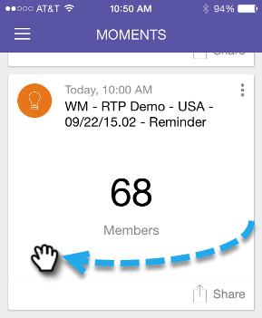

# 완료 표시 {#marking-it-done}

스트림에서 이메일 프로그램, 이벤트 또는 분석 카드를 제거하도록 완료 로 표시합니다. 두 가지 방법이 있습니다.

1. 작업 메뉴를 누릅니다.

   

1. 탭 **완료**.

   

1. 또는 어느 쪽이든 카드를 밀으세요.

   

   >[!NOTE]
   >
   >카드를 완료 로 표시해도 이메일, 이벤트 또는 스마트 캠페인이 삭제되지 않습니다. 일시/이후 스트림에서만 완료 스트림으로 이동합니다.

케이크 한 조각!
