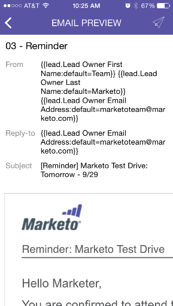

# 이메일 미리보기 {#previewing-an-email}

트리거를 가져오기 전에 이메일 카드를 마우스 오른쪽 단추로 클릭하여 미리 봅니다.

>[!IMPORTANT]
>
>2023년 10월 2일, Adobe은 모든 앱스토어에서 Marketo 모먼트 앱을 제거했습니다. 태블릿/모바일 장치에 이미 앱이 설치되어 있는 경우 당분간 앱을 계속 사용할 수 있습니다. Marketo 인증을 위해 Marketo Engage 인스턴스가 Adobe ID로 마이그레이션되면 더 이상 앱에 액세스할 수 없습니다. [자세히 알아보기](https://nation.marketo.com/t5/product-discussions/marketo-events-app-and-marketo-moments-app-end-of-life/m-p/340712/highlight/true#M193869){target="_blank"}

1. 이메일 카드에서 점 3개 동작 메뉴를 탭합니다.

   

1. **[!UICONTROL Preview Email]**&#x200B;을(를) 누릅니다.

   

1. 장치에서 이메일을 볼 수 있습니다.

   

   >[!NOTE]
   >
   >이메일 미리 보기 페이지에서 바로 샘플을 보내려면 오른쪽 상단의 종이 비행기 아이콘을 탭합니다.
