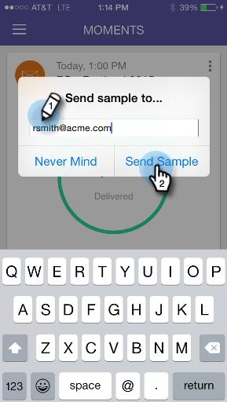

# 샘플 보내기 {#sending-a-sample}

이메일의 샘플을 다른 사람과 직접 공유할 수 있습니다. 두 가지 방법이 있습니다.

## The Regular Way {#the-regular-way}

1. 카드 메뉴를 엽니다.

   

1. 샘플 **보내기를 누릅니다**.

   

1. 이메일 주소를 입력하고 샘플 **보내기를 클릭합니다**.

   

## 빠른 길 {#the-quick-way}

1. 이메일 미리 보기 화면에서 종이 비행기 아이콘을 눌러 미리 보기에서 바로 샘플을 전송합니다.\
   

임무 완료!
