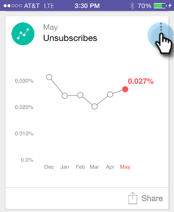
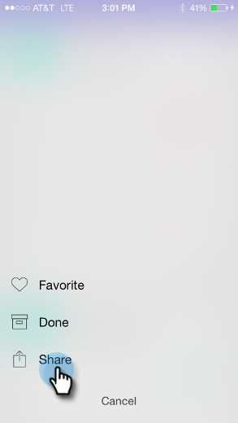

# Moments 공유 {#sharing-a-moment}

시간을 나누는 방법은 두 가지가 있습니다.

>[!IMPORTANT]
>
>2023년 10월 2일, Adobe은 모든 앱스토어에서 Marketo 모먼트 앱을 제거했습니다. 태블릿/모바일 장치에 이미 앱이 설치되어 있는 경우 당분간 앱을 계속 사용할 수 있습니다. Marketo 인증을 위해 Marketo Engage 인스턴스가 Adobe ID로 마이그레이션되면 더 이상 앱에 액세스할 수 없습니다. [자세히 알아보기](https://nation.marketo.com/t5/product-discussions/marketo-events-app-and-marketo-moments-app-end-of-life/m-p/340712/highlight/true#M193869){target="_blank"}

1. 카드에서 **[!UICONTROL Share]** 아이콘을 탭합니다.

   

1. 카드 메뉴를 탭하고 세부 정보 화면에서 **[!UICONTROL Share]**&#x200B;을(를) 탭합니다.

   

   

1. 공유할 방법을 선택하십시오. 이 예에서는 이메일이 선택되어 있습니다.

   >[!NOTE]
   >
   >공유는 휴대폰에 설치된 앱에 따라 다릅니다. [!DNL Facebook]이(가) 설치되어 있지 않으면 [잠시 후]에 나타나지 않습니다.

   

1. 받는 사람의 주소, 제목을 입력하고 **[!UICONTROL Send]**&#x200B;을(를) 누릅니다.

   
